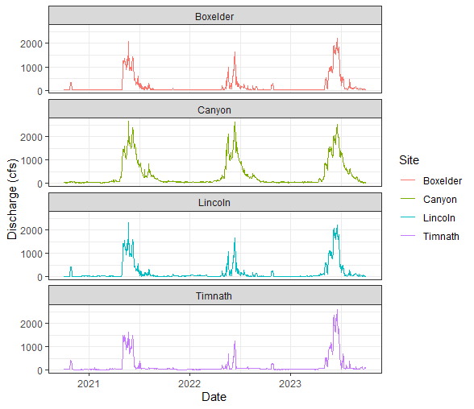
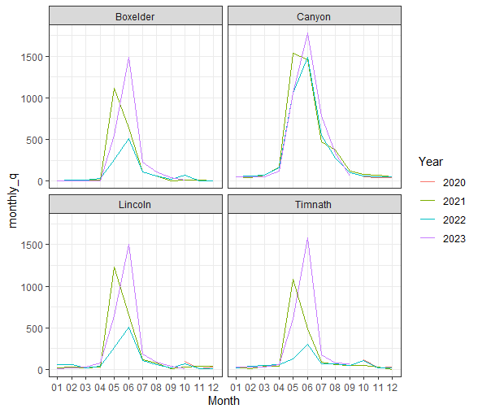
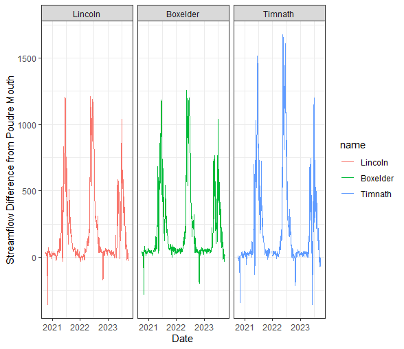
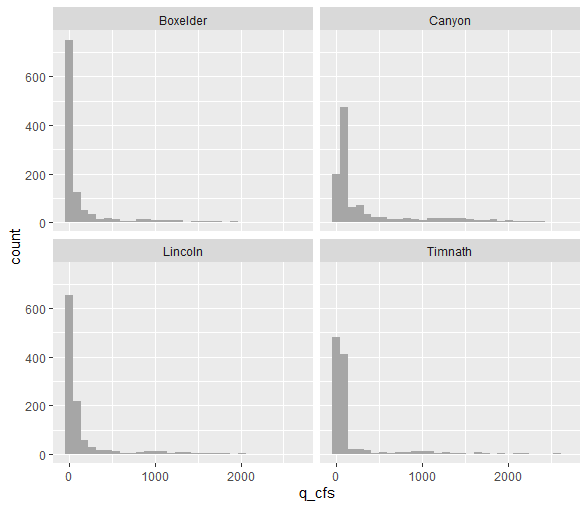

# R Skills Review

```{r include=FALSE}
#knitr::opts_chunk$set(echo=TRUE, eval=TRUE, message=FALSE, warning=FALSE, rows.print=5, fig.width=9)
```

In this lesson you will take all of the skills you have learned up to this point and use them on a completely new set of data.

#### Necessary packages:

```{r include=FALSE}
library(tidyverse)
library(rstatix)
library(httr)
library(jsonlite)
library(dataRetrieval)
library(sf) # for the map
library(mapview) # for making the interactive plot
```

```{r eval=FALSE}
library(tidyverse)
library(rstatix)

# new packages! Only if you want to work through the data retrieval process
library(httr)
library(jsonlite)
library(dataRetrieval)
```

## Tidying datasets

We are interested in looking at how the Cache la Poudre River's flow changes over time and space as it travels out of the mountainous Poudre Canyon and through Fort Collins.

There are four stream flow monitoring sites on the Poudre that we are interested in: two managed by the US Geological Survey (USGS), and two managed by the Colorado Division of Water Resources (CDWR):

```{r echo = FALSE}
# Making a tibble to convert into coordinates for our sites
poudre_sites <- tibble(site = c("Canyon Mouth", "Lincoln Bridge", "Boxelder", "Timnath"),
                       site_no = c("CLAFTCCO", "06752260", "06752280", "CLARIVCO"),
                       lat = c(40.6645, 40.5880833, 40.5519269, 40.5013),
                       long = c(-105.2242, -105.0692222, -105.011365, -104.967),
                       source = c("CDWR", "USGS", "USGS", "CDWR")) %>%
  sf::st_as_sf(coords = c("long", "lat"), crs = 4269)

# Mapview is another package that creates interactive plots, not necessary for you to know yet! More in 523a :-)
mapview::mapview(poudre_sites, zcol = "site", layer.name = "Poudre River Monitoring")
```

<br>

We are going to work through retrieving the raw data from both the USGS and CDWR databases.

### Get USGS stream flow data

Using the `dataRetrieval` package we can pull all sorts of USGS water data. You can read more about the package, functions available, metadata etc. here: <https://doi-usgs.github.io/dataRetrieval/index.html>

```{r eval = FALSE}

# pulls USGS daily ('dv') stream flow data for those two sites:
usgs <- dataRetrieval::readNWISdv(siteNumbers = c("06752260", "06752280"), # USGS site code for the Poudre River at the Lincoln Bridge and the ELC
                                  parameterCd = "00060", # USGS code for stream flow
                                  startDate = "2020-10-01", # YYYY-MM-DD formatting
                                  endDate = "2023-10-01") %>% # YYYY-MM-DD formatting
  rename(q_cfs = X_00060_00003) %>% # USGS code for stream flow units in cubic feet per second (CFS)
  mutate(Date = lubridate::ymd(Date), # convert the Date column to "Date" formatting using the `lubridate` package
         Site = case_when(site_no == "06752260" ~ "Lincoln", 
                          site_no == "06752280" ~ "Boxelder")) 

# if you want to save the data:
#write_csv(usgs, 'data/review-usgs.csv')

```

### Get CDWR stream flow data

Alas, CDWR doesn't have an R packge to easily pull data from their API like USGS does, but they do have user-friendly instructions about how to develop API calls.

**Don't stress if you have no clue what an API is**! We will learn a lot more about them in 523A, but this is good practice for our function writing and mapping skills.

Using the ["URL Generator" steps outlined]((https://dwr.state.co.us/Rest/GET/Help/SurfaceWaterTSDayGenerator)), if we wanted data from 2020-2022 for the Canyon mouth side (site abbreviation = CLAFTCCO), it generates this URL to retrieve that data:

[https://dwr.state.co.us/Rest/GET/api/v2/surfacewater/surfacewatertsday/?format=json&dateFormat=dateOnly&fields=abbrev%2CmeasDate%2Cvalue%2CmeasUnit&encoding=deflate&abbrev=CLAFTCCO&min-measDate=10%2F01%2F2020&max-measDate=09%2F30%2F2022](https://dwr.state.co.us/Rest/GET/Help/SurfaceWaterTSDayGenerator){.uri}

However, we want to pull this data for two different sites, and may want to change the year range of data. Therefore, we can write a function to pull data for our various sites and time frames:

```{r eval=FALSE}

# Functin to retrieve data
co_water_data <- function(site, start_year, end_year){
  
  raw_data <- httr::GET(url = paste0("https://dwr.state.co.us/Rest/GET/api/v2/surfacewater/surfacewatertsday/?format=json&dateFormat=dateOnly&fields=abbrev%2CmeasDate%2Cvalue%2CmeasUnit&encoding=deflate&abbrev=",site,
                                     "&min-measDate=10%2F01%2F", start_year,
                                     "&max-measDate=09%2F30%2F", end_year))
  
  # extract the text data, returns a JSON object
  extracted_data <- httr::content(raw_data, as = "text", encoding = "UTF-8") 
  
  # parse text from JSON to data frame
  final_data <- jsonlite::fromJSON(extracted_data)[["ResultList"]]
  
  return(final_data)
  
}


```

Now, lets use that function to pull data for our two CDWR sites of interest, which we can iterate over with `map()`. Since this function returns data frames with the same structure an variable names, we can use `map_dfr()` to bind the two data frames into a single one:

```{r eval=FALSE}
# run function for our two sites
sites <- c("CLAFTCCO","CLARIVCO")

cdwr <- sites %>% 
  map_dfr(~ co_water_data(site = .x, start_year = 2020, end_year = 2023))
 
# If you want to save this file
#write_csv(cdwr, 'data/review-cdwr.csv') 
```

### OR, read in the .csv's we already generated and saved for you:

Read in our two data sets. You will find that they provide the same information (daily streamflow from 2020-2022) but their variable names and structures are different:

```{r}
usgs <- read_csv('data/review-usgs.csv')

cdwr <- read_csv('data/review-cdwr.csv') 

```

When we look at these two datasets, we see they provide the same information (daily streamflow from 2020-2023) but their variable names and structures are different:

```{r}
glimpse(usgs)

glimpse(cdwr)
```

Therefore, in order to combine these two datasets from different sources we need to do some data cleaning.

Lets first focus on cleaning the cdwr dataset to match the structure of the usgs one:

```{r}
cdwr_clean <- cdwr %>%
  # rename data and streamflow vars to match name of usgs vars
  rename(q_cfs = value) %>%
  # Add site and agency vars
  mutate(Date = lubridate::ymd(measDate),
         Site = ifelse(abbrev == "CLAFTCCO", "Canyon",
                       "Timnath"),
         agency_cd = "CDWR")
```

Now, we can join our USGS and CDWR data frames together with `bind_rows()`.

```{r}
data <- bind_rows(usgs,cdwr_clean)
```

## Exploratory Data Analysis

Let's explore the data to see if there are any trends we can find visually. We can first visualize the data as time series:

```{r eval=FALSE}
# Discharge (in CFS) through time displaying all four of our monitoring sites.
data %>%
  ggplot(aes(x = Date, y = q_cfs, color = Site)) +
  geom_line() +
  theme_bw() +
  xlab("Date") +
  ylab("Discharge (cfs)") +
  facet_wrap( ~ Site, ncol = 1)
```



Say we wanted to examine differences in annual stream flow. We can do this with a little data wrangling, using the `separate()` function to split our "Date" column into Year, Month, and Day columns.

```{r}
data_annual <- data %>% 
  separate(Date, into = c("Year", "Month", "Day"), sep = "-") %>% 
  # create monthly avg for plots
  group_by(Site, Year, Month) %>%
  summarise(monthly_q = mean(q_cfs))
  
```

```{r eval = FALSE}
# visualize annual differences across the course of each year
data_annual %>% 
  ggplot(aes(x = Month, y = monthly_q, group = Year)) +
  geom_line(aes(colour = Year))+
  facet_wrap(~Site) +
  theme_bw()

```



Let's look at the daily difference in discharge between the mouth of the Cache la Poudre River (Canyon Mouth site) and each of the sites downstream. This will require some more wrangling of our data.

```{r}
dif_data <- data %>%
  # select vars of interest
  select(Site, Date, q_cfs) %>%
  # create a column of streamflow values for each site
  pivot_wider(names_from = Site, values_from = q_cfs) %>%
  # for each downstream site, create a new column that is the difference from the Canyon mouth site
  mutate_at(c("Boxelder", "Lincoln", "Timnath"), .funs = ~ (Canyon - .)) %>% 
  # if you wanted to create new variables use this instead:
  #mutate_at(c("Boxelder", "Lincoln", "Timnath"), .funs = list(dif = ~ (Canyon - .))) %>%
  # then pivot these new columns (i.e., NOT the date and canyon columns) longer again
  pivot_longer(-c(Canyon, Date))

```

```{r eval = FALSE}
dif_data %>% 
  # This changes our 'name' varible to a factor, so the sites plot in order of their distance from the canyon mouth
  mutate(name = fct(name, levels = c("Lincoln", "Boxelder", "Timnath"))) %>% 
  ggplot() +
    geom_line(aes(x = Date, y = value, color = name)) +
    theme_bw() +
    facet_wrap("name")+
    ylab("Streamflow Difference from Poudre Mouth")
```



## Data Analysis

Through our exploratory data analysis, it *appears* that stream flow decreases as we move through town. But, how can we test if these flows are significantly different, and identify the magnitude/direction of these differences?

Because we will be comparing daily stream flow across multiple sites, we can use an ANOVA test to assess this research question. We will set our alpha at 0.05.

### Testing for normal distribution

ANOVA assumes normal distribution within each group - we can visualize each site's data with a histogram:

```{r eval = FALSE}
ggplot(data = data, aes(x = q_cfs)) +
         geom_histogram() + 
  facet_wrap (~Site)
```



... and use the `shapiro_test()` function along with `group_by()` to statistically test for normality within each site's daily stream flow data:

```{r}
data %>%
  group_by(Site) %>%
  shapiro_test(q_cfs)
```

Since the null hypothesis of the Shapiro-Wilk test is that the data is normally distributed, these results tell us all groups do not fit a normal distribution for daily stream flow. It is also quite clear from their histograms that they are not normally distributed.

### Testing for equal variance

To test for equal variances among more than two groups, it is easiest to use a Levene's Test like we have done in the past:

```{r}
data %>%
  levene_test(q_cfs ~ Site)
```

Given this small p-value, we see that the variances of our groups are not equal.

### ANOVA - Kruskal-Wallis

After checking our assumptions we need to perform a non-parametric ANOVA test, the Kruskal-Wallis test.

```{r}
data %>%
  kruskal_test(q_cfs ~ Site)
```

Our results here are highly significant (at alpha = 0.05), meaning that at least one of our group's mean stream flow is significantly different from the others.

### ANOVA post-hoc analysis

Since we used the non-parametric Kruskal-Wallace test, we can use the associated Dunn's test to test across our sites for significant differences in mean stream flow:

```{r}
data %>% 
  dunn_test(q_cfs ~ Site)
```

The results of our Dunn test signify that all of our sites are significantly different from eachother mean streamflow across our sites are significantly different.

THOUGHT EXPERIMENT 1: Based on our results, which of our two gages have the greatest difference in mean daily stream flow?

THOUGHT EXPERIMENT 2: Is this an appropriate test to perform on stream flow data? Why or why not?
