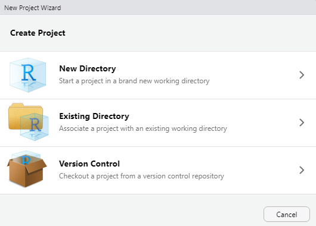

# Welcome!

This site hosts the course curriculum for Colorado State University's **WR 696** course: *Introduction to Data Analysis in R*

## Set up Instructions {.unnumbered}

As your first step, please follow the instructions on the [R Setup][Setup Instructions] page to make sure you have all the necessary software installed on your computer before the class starts.

## Navigating this site {.unnumbered}

The table of contents on the left allows you to navigate to the lesson for each week of the course. Each lesson will walk you through the topic(s), analysis, etc. for that week. There are exercises at the end of the lesson that will be that week's homework assignment.

Homework will be submitted through Canvas and exercise questions (including any code, figures, etc.) must be submitted as a rendered R Markdown document in Word or HTML format. The Intro to R and R Markdown lesson will walk through how to create these R Markdown documents; you will use these R Markdowns as the basis for writing your code/answers to the exercises and then render them to either a Word or HTML report which is what you will submit through Canvas.

## Goals {.unnumbered}

The broad goal of this course is to introduce you to the skills necessary for a career that involves data science - namely manipulating data sets and performing statistical tests in R. The more specific goals of this course are to teach students to:

1.  Navigate the RStudio interface and create R Markdown documents for reproducible reporting;
2.  Utilize R packages and functions to manipulate and analyze data effectively and apply data wrangling techniques using the {tidyverse} framework;
3.  Differentiate between various data types and structures within R; and
4.  Explore comparative analyses, linear regression, and trend analysis techniques to reveal patterns in data.

## Approach and Expectations {.unnumbered}

This class is [flipped](https://ieeexplore.ieee.org/document/7344151), meaning all materials for the week ahead must be reviewed before class. To encourage this we will have weekly quizzes on pre-class content each Monday before we dive into the assignment.

So without lectures in class what do we do together? We code! This class has almost four hours of contact time per week, and we design lessons so that you should be able to finish your assignments in class. The flipped class allows for deeper discussion about the common pitfalls of coding and allows for collaborative work time with your fellow classmates.

Generally we will do a quick live-code review of concepts from the assignment and the pre-class materials, but more than 1.5 hours per day will be dedicated to you coding and working on the assignment in class.

As such, coming to class is a vital part of how you can be successful and we fully expect you to be there every day.

We also will actively encourage a collaborative coding environment where students help each other and discuss the best approach to solving various coding problems. We also hope that outside of class, you will use our Teams channel to discuss code issues!

We will always send announcements with assignments, web links, and other updates through Canvas. The course syllabus will also be posted on Canvas.

## Class Schedule {.unnumbered}

+------+---------------+----------------------------------------------------------------------------------------------------------------------------------------------------------------------------------------------------------------------------------------------------------------------+
| Week | Data (Monday) | Content                                                                                                                                                                                                                                                              |
+------+---------------+----------------------------------------------------------------------------------------------------------------------------------------------------------------------------------------------------------------------------------------------------------------------+
| 1    | 8/22          | Before class: [Primers Basics](https://posit.cloud/learn/primers/1) and [R Markdown](https://rmarkdown.rstudio.com/lesson-1.html?_gl=1*10u3rje*_ga*NzUxNjg2ODAzLjE2OTE1MTIzMzk.*_ga_2C0WZ1JHG0*MTY5MTUxNjA2OC4yLjEuMTY5MTUxNjU2Ni4wLjAuMA..); download R and RStudio |
|      |               |                                                                                                                                                                                                                                                                      |
|      |               | Introduction to R, RStudio, RMarkdown                                                                                                                                                                                                                                |
+------+---------------+----------------------------------------------------------------------------------------------------------------------------------------------------------------------------------------------------------------------------------------------------------------------+
| 2    | 8/28          | Before class: [Work with Data](https://posit.cloud/learn/primers/2)                                                                                                                                                                                                  |
|      |               |                                                                                                                                                                                                                                                                      |
|      |               | Exploratory data analysis                                                                                                                                                                                                                                            |
+------+---------------+----------------------------------------------------------------------------------------------------------------------------------------------------------------------------------------------------------------------------------------------------------------------+
| 3    | 9/4           | **No Class Monday 9/4!** Before class Wednesday: [Visualize Data](https://posit.cloud/learn/primers/3)                                                                                                                                                               |
|      |               |                                                                                                                                                                                                                                                                      |
|      |               | Data visualization                                                                                                                                                                                                                                                   |
+------+---------------+----------------------------------------------------------------------------------------------------------------------------------------------------------------------------------------------------------------------------------------------------------------------+
| 4    | 9/11          | Before class: [Tidy Your Data](https://posit.cloud/learn/primers/4)                                                                                                                                                                                                  |
|      |               |                                                                                                                                                                                                                                                                      |
|      |               | T-tests, ANOVA                                                                                                                                                                                                                                                       |
+------+---------------+----------------------------------------------------------------------------------------------------------------------------------------------------------------------------------------------------------------------------------------------------------------------+
| 5    | 9/18          | Before class: [Iterate](https://posit.cloud/learn/primers/5)                                                                                                                                                                                                         |
|      |               |                                                                                                                                                                                                                                                                      |
|      |               | Linear modelling pt. 1                                                                                                                                                                                                                                               |
+------+---------------+----------------------------------------------------------------------------------------------------------------------------------------------------------------------------------------------------------------------------------------------------------------------+
| 6    | 9/25          | Before class: [Write Functions](https://posit.cloud/learn/primers/6)                                                                                                                                                                                                 |
|      |               |                                                                                                                                                                                                                                                                      |
|      |               | Linear modelling pt. 2                                                                                                                                                                                                                                               |
+------+---------------+----------------------------------------------------------------------------------------------------------------------------------------------------------------------------------------------------------------------------------------------------------------------+
| 7    | 10/2          | Modelling assumptions, power                                                                                                                                                                                                                                         |
+------+---------------+----------------------------------------------------------------------------------------------------------------------------------------------------------------------------------------------------------------------------------------------------------------------+
| 8    | 10/9          | PCA                                                                                                                                                                                                                                                                  |
+------+---------------+----------------------------------------------------------------------------------------------------------------------------------------------------------------------------------------------------------------------------------------------------------------------+

## Additional introductory resources {.unnumbered}

If you are looking to learn even more outside of what this class offers, below are some great introductory R resources:

-   [Stat 158](https://csu-r.github.io/Module1/) - Vectors, data frames, installing R, etc...

-   [RStudio Materials](https://education.rstudio.com/learn/beginner/) - A series of videos, books, and more to get you started in R.

#### Tidyverse Introduction

-   [R for Data Science](https://r4ds.had.co.nz/introduction.html) - Covers all of the basic intro material, from a tidyverse perspective. As discussed, this is one way to find solutions in R, it happens to be my preferred way, but there are lots of Base R ways that work just fine!

-   [Stat 159](https://csu-r.github.io/Module2/) - A CSU specific course for an intro to the tidyverse

-   [R Markdown](https://bookdown.org/yihui/rmarkdown/#preface) - The primary book for learning more about R Markdown and all of its quirks.

-   [Cheatsheets](https://www.rstudio.com/resources/cheatsheets/) - Short, clear documents that cover so much material from dplyr to shiny apps. Great for quick references. We find the [`rmarkdown`](https://rstudio.github.io/cheatsheets/html/rmarkdown.html?_gl=1*1f2w4s3*_ga*MTc5NTY0NDA0Mi4xNjg2MzQ0MDUy*_ga_2C0WZ1JHG0*MTY5MTk1OTY1Ni42LjAuMTY5MTk1OTY1Ni4wLjAuMA..) and [`ggplot2`](https://rstudio.github.io/cheatsheets/html/data-visualization.html?_gl=1*1f2w4s3*_ga*MTc5NTY0NDA0Mi4xNjg2MzQ0MDUy*_ga_2C0WZ1JHG0*MTY5MTk1OTY1Ni42LjAuMTY5MTk1OTY1Ni4wLjAuMA..) ones particularly useful!

<!--chapter:end:index.Rmd-->

# Setup Instructions

This tutorial walks you through all the **required** setup steps for using R and RStudio in this course. Please use our class's Teams Channel to post any questions/problems that you encounter.


## Install R and RStudio

**R** is an open source language and software environment for statistical analysis and graphics (plus so much more!). You must **first download the R software (for free) here: <https://www.r-project.org/>.**

-   Click the download link based on your operating system (OS). Then, for Mac users, install the latest release based on your macOS. For Windows users, click the 'install R for the first time' link.

*Note: If you already have R installed, you **must have at least version 4.0.0. or greater**, but it is best to have the most recent version installed (4.3.1)*

**RStudio** is a (also free) R Integrated Development Environment (IDE) that provides a built-in editor and other advantages such as version control and project management. **Once you have the R software installed on your computer, you can install RStudio Desktop here: <https://posit.co/download/rstudio-desktop/>.**

-   Under **Step 2** click the download RStudio Desktop button.

## Package Installation

While the R software comes with many pre-loaded functions (referred to as 'base R' functions) to perform various operations in R, there are thousands of R packages that provide additional reusable R functions. In order to use these functions you need to first install the package to your local machine using the `install.packages()` function. Once a package is installed on your computer you don't need to install it again (but you may have to update it). Anytime you want to use the package in a new R session you can load it with the `library()` function.

We will be working in RStudio for this entire course, so after you have installed both R and RStudio, **open a new session of RStudio.**

You will learn more about the ins and outs of RStudio in class, but for set up purposes you will just be running code in the Console. Normally you want to save the code you write, but since package installation is only needed once (unless you are working on a new machine or need to update any packages) you can execute this directly in the console.

Run the following three lines of code (one at a time) in the console. *You can click the copy button in the upper right corner when you hover over the code chunk, then paste that after the `>` in the Console. Spelling and capitalization is important!*

**Install the {tidyverse} package.** The Tidyverse is actually a collection of multiple R packages designed for data manipulation, exploration, and visualization that you are likely to use in every day data analysis. When you install the Tidyverse, it installs all of these packages, and you can later load all of them in your R session with `library(tidyverse).` Since you are installing multiple packages here this may take a little while.


```r
install.packages("tidyverse")
```

**Install the {palmerpenguins} package.** This is a data package that installs a couple of spreadsheets you can load and work with in R.


```r
install.packages("palmerpenguins")
```

**Install the {rmarkdown} package**. Later on in the course you will be working in and rendering R Markdown files and reports. R Markdown is a notebook style interface integrating text and code, allowing you to create fully reproducible documents and render them to various elegantly formatted static or dynamic outputs.

You can learn more about R Markdown at their website, which has really informative lessons on their [Getting Started](https://rmarkdown.rstudio.com/lesson-1.html) page, and see the range of outputs you can create at their [Gallery](https://rmarkdown.rstudio.com/gallery.html) page.


```r
install.packages("rmarkdown")
```

To see if you successfully installed all three packages, use the `library()` function to load the packages into your session. You should either see nothing printed to the console after running `library()`, or in the case of the `tidyverse` you may see some messages printed. As long as there are no `error` messages, you should be all set! Please use our class's Teams Channel for assistance if you get any error messages.


```r
library(tidyverse)
library(palmerpenguins)
library(rmarkdown)
```

<!--chapter:end:01-R-setup.Rmd-->

# Introduction to R, RStudio and R Markdown


In this lesson we will get a general introduction to coding in RStudio, using R Markdown, some R fundamentals such as data types and indexing, and touch on a range of coding topics that we will dive into deeper throughout the course.

## Getting to know RStudio

When you first open RStudio, it is split into 3 panels:

-   **The Console** (left), where you can directly type and run code (by hitting Enter)
-   **The Environment/History pane** (upper-right), where you can view the objects you currently have stored in your environment and a history of the code you've run
-   **The Files/Plots/Packages/Help pane** (lower-right), where you can search for files, view and save your plots, view and manage what packages are loaded in your library and session, and get R help.

{width="100%"}

<br>

To write and save code you use .R scripts (or RMarkdown, which we will learn shortly). You can open a new script with File -\> New File or by clicking the icon with the green plus sign in the upper left corner. When you open a script, RStudio then opens a fourth **'Source' panel** in the upper-left to write and save your code. You can also send code from a script directly to the console to execute it by highlighting the **entire** code line/chunk (or place your cursor at the end of the code chunk) and hit CTRL+ENTER on a PC or CMD+ENTER on a Mac.


It is good practice to add comments/notes throughout your scripts to document what the code is doing. To do this start a line with a `#`. R knows to ignore everything after a `#`, so you can write whatever you want there. Note that R reads line by line, so if you want your comments to carry over multiple lines you need a `#` at every line.

<hr>

## R Projects

As a first step whenever you start a new project, workflow, analysis, etc., it is good practice to set up an R project. R Projects are RStudio's way of bundling together all your files for a specific project, such as data, scripts, results, figures. Your project directory also becomes your working directory, so everything is self-contained and easily portable.

We recommend using a single R Project (i.e., contained in a single folder) for this course, so lets create one now.

You can start an R project in an existing directory or in a new one. To create a project go to File -\> New Project:



Let's choose 'New Directory' then 'New Project'. Now choose a directory name, this will be both the folder name and the project name, so use proper spelling conventions (**no spaces!**). We recommend naming it something course specific, like 'WR-696-2023', or even more generic 'Intro-R-Fall23'. Choose where on your local file system you want to save this new folder/project (somewhere you can find it easily), then click 'Create Project'.

Now you can see your RStudio session is working in the R project you just created. You can see the working directory printed at the top of your console is now the project directory, and in the 'Files' tab in RStudio you can see there is an .Rproj file with the same name as the R project, which will open up this R project in RStudio whenever you come back to it.

**Test out how this .Rproj file works**. Close out of your R session, navigate to the project folder on your computer, and double-click the .Rproj file.

::: {.alert .alert-info}
***What is a working directory?*** A working directory is the default file path to a specific file location on your computer to read files from or save files to. Since everyone's computer is unique, everyone's full file paths will be different. This is an advantage of working in R Projects, you can use *relative* file paths, since the working directory defaults to wherever the .RProj file is saved on your computer you don't need to specify the full unique path to read and write files within the project directory.
:::

<hr>

## Write a set-up script

Let's start coding!

The first thing you do in a fresh R session is set up your environment, which mostly includes installing and loading necessary libraries and reading in required data sets. Let's open a fresh R script and save it in our root (project) directory. Call this script 'setup.R'.

### Functions

Before creating a set up script, it might be helpful to understand the use of functions in R if you are new to this programming language. R has many built-in functions to perform various tasks. To run these functions you type the function name followed by parentheses. Within the parentheses you put in your specific arguments needed to run the function.


```r
# mathematical functions with numbers
log(10)
```

```
## [1] 2.302585
```

```r
# average a range of numbers
mean(1:5)
```

```
## [1] 3
```

```r
# nested functions for a string of numbers, using the concatenate function 'c'
mean(c(1,2,3,4,5))
```

```
## [1] 3
```

```r
# functions with characters
print("Hello World")
```

```
## [1] "Hello World"
```

```r
paste("Hello", "World", sep = "-")
```

```
## [1] "Hello-World"
```

### Packages

R Packages include reusable functions that are not built-in with R. To use these functions, you must install the package to your local system with the `install.packages()` function. Once a package is installed on your computer you don't need to install it again (*you will likely need to update it at some point though*). Anytime you want to use the package in a new R session you load it with the `library()` function.

**When do I use** `::` ?

If you have a package installed, you don't necessarily have to load it in with `library()` to use it in your R session. Instead, you can type the package name followed by `::` and use any functions in that package. This may be useful for some one-off functions using a specific package, however if you will be using packages a lot throughout your workflow you will want to load it in to your session. You should also use `::` in cases where you have multiple packages loaded that may have conflicting functions (e.g., `plot()` in Base R vs. `plot()` in the {terra} package).

#### Base R vs. The Tidyverse

You may hear us use the terms 'Base R' and 'Tidyverse' a lot throughout this course. Base R includes functions that are installed with the R software and do not require the installation of additional packages to use them. The Tidyverse is a collection of R packages designed for data manipulation, exploration, and visualization that you are likely to use in every day data analysis, and all use the same design philosophy, grammar, and data structures. When you install the Tidyverse, it installs all of these packages, and you can then load all of them in your R session with `library(tidyverse)`. Base R and the Tidyverse have many similar functions, but many prefer the style, efficiency and functionality of the Tidyverse packages, and we will mostly be sticking to Tidyverse functions for this course.

#### Package load function

To make code reproducible (meaning anyone can run your code from their local machines) we can write a function that checks whether or not necessary packages are installed, if not install them and load them, or if they are already installed it will only load them and not re-install. This function looks like:


```r
packageLoad <-
  function(x) {
    for (i in 1:length(x)) {
      if (!x[i] %in% installed.packages()) {
        install.packages(x[i])
      }
      library(x[i], character.only = TRUE)
    }
  }
```

For each package name given ('x') it checks if it is already installed, if not installs it, and then loads that package into the session. In future lessons we will learn more about writing custom functions, and iterating with for loops, but for now you can copy/paste this function and put it at the top of your set up script. When you execute this chunk of code, you won't see anything printed in the console, however you should now see `packageLoad()` in your Environment under 'Functions'. You can now use this function as many times as you want. Test is out, and use it to install the Tidyverse package(s).


```r
packageLoad('tidyverse')
```

You can also give this function a string of package names. Lets install all the packages we will need for the first week, or if you already followed the set up instructions, this will just load the packages into your session since you already installed them.


```r
# create a string of package names
packages <- c('tidyverse',
              'palmerpenguins',
              'rmarkdown')
# use the packageLoad function we created on those packages
packageLoad(packages)
```

Since this is code you will be re-using throughout your workflows, we will save it as its own script and run it at the beginning of other scripts/documents using the `source()` function as a part of our reproducible workflows.

<hr>

## R Markdown

Throughout this course you will be working mostly in R Markdown documents. R Markdown is a notebook style interface integrating text and code, allowing you to create fully reproducible documents and render them to various elegantly formatted static or dynamic outputs (which is how you will be submitting your assignments).

You can learn more at the R Markdown website, which has really informative lessons on the [Getting Started](https://rmarkdown.rstudio.com/lesson-1.html) page and you can see the range of outputs you can create at the [Gallery](https://rmarkdown.rstudio.com/gallery.html) page.

### What About Quarto?

Some of you may have heard of Quarto, which is essentially an extension of R Markdown but it lives as its own software to allow its use in other languages such as Python, Julia and Observable. You can install the Quarto CLI on its own and RStudio will detect it so you can create documents within the IDE, or alternatively with newer versions of RStudio a version of Quarto is built-in and you can enable Quarto through the R Markdown tab in Global Options. R Markdown isn't going anywhere, however many in the data science realm are switching to Quarto. Quarto documents are very similar to R Markdown, in fact Quarto can even render R Markdown documents, so after learning R Markdown in this course you should have some of the fundamental skills to easily switch to Quarto if you want to. You can read more about Quarto [here](https://quarto.org/).

### Getting started with R Markdown

Let's create a new document by going to File -\> New File -\> R Markdown. You will be prompted to add information like title and author, fill those in (let's call it "Intro to R and R Markdown") and keep the output as HTML for now. Click OK to create the document.

This creates an outline of an R Markdown document, and you see the title, author and date you gave the prompt at the top of the document which is called the YAML header.

Notice that the file contains three types of content:

-   An (optional) YAML header surrounded by `---`s

-   R code chunks surrounded by ```` ``` ````s

-   text mixed with simple text formatting

Since this is a notebook style document, you run the code chunks by clicking the green play button in the top right corner of each code chunk, and then the output is returned directly below the chunk.

::: {.alert .alert-info}
If you'd rather have the code chunk output go to the console instead of directly below the chunk in your R Markdown document, go to Tools -\> Global Options -\> R Markdown and uncheck "Show output inline for all R Markdown documents"
:::

When you want to create a report from your notebook, you render it by hitting the 'knit' button at the top of the Source pane (with the ball of yarn next to it), and it will render to the format you have specified in the YAML header. In order to do so though, you need to have the {rmarkdown} package installed.

You can delete the rest of the code/text below the YAML header, and insert a new code chunk at the top. **You can insert code chunks by clicking the green C with the '+' sign at the top of the source editor, or with the keyboard short cut (Ctrl+Alt+I for Windows, Option+Command+I for Macs)**. For the rest of the lesson (and course) you will be writing and executing code through code chunks, and you can type any notes in the main body of the document.

The first chunk is almost always your set up code, where you read in libraries and any necessary data sets. Here we will execute our set up script to install and load all the libraries we need:


```r
source("setup.R")
```

<hr>

## Explore

Normally when working with a new data set, the first thing we do is explore the data to better understand what we're working with. To do so, you also need to understand the fundamental data types and structures you can work with in R.

### The `penguins` data

For this intro lesson, we are going to use the Palmer Penguins data set (which is loaded with the {palmerpenguins} package you installed in your set up script). This data was collected and made available by [Dr. Kristen Gorman](https://www.uaf.edu/cfos/people/faculty/detail/kristen-gorman.php) and the [Palmer Station, Antarctica LTER](https://pallter.marine.rutgers.edu/), a member of the [Long Term Ecological Research Network](https://lternet.edu/).

Load the `penguins` data set.


```r
data("penguins")
```

You now see it in the Environment pane. Print it to the console to see a snapshot of the data:


```r
penguins
```

```
## # A tibble: 344 x 8
##    species island    bill_length_mm bill_depth_mm flipper_length_mm body_mass_g
##    <fct>   <fct>              <dbl>         <dbl>             <int>       <int>
##  1 Adelie  Torgersen           39.1          18.7               181        3750
##  2 Adelie  Torgersen           39.5          17.4               186        3800
##  3 Adelie  Torgersen           40.3          18                 195        3250
##  4 Adelie  Torgersen           NA            NA                  NA          NA
##  5 Adelie  Torgersen           36.7          19.3               193        3450
##  6 Adelie  Torgersen           39.3          20.6               190        3650
##  7 Adelie  Torgersen           38.9          17.8               181        3625
##  8 Adelie  Torgersen           39.2          19.6               195        4675
##  9 Adelie  Torgersen           34.1          18.1               193        3475
## 10 Adelie  Torgersen           42            20.2               190        4250
## # i 334 more rows
## # i 2 more variables: sex <fct>, year <int>
```

<hr>

### Data Types

This data is structured as a data frame, probably the most common data type and one you are most familiar with. These are like Excel spreadsheets: tabular data organized by rows and columns. However we see at the top this is called a `tibble` which is just a fancy kind of data frame specific to the Tidyverse.

At the top we can see the data type of each column. There are five main data types:

-   **character**: `"a"`, `"swc"`

-   **numeric**: `2`, `15.5`

-   **integer**: `2L` (the `L` tells R to store this as an integer)

-   **logical**: `TRUE`, `FALSE`

-   **complex**: `1+4i` (complex numbers with real and imaginary parts)

Data types are combined to form data structures. R's basic data structures include:

-   atomic vector

-   list

-   matrix

-   data frame

-   factors

You can see the data type or structure of an object using the `class()` function, and get more specific details using the `str()` function. (Note that 'tbl' stands for tibble).


```r
class(penguins)
```

```
## [1] "tbl_df"     "tbl"        "data.frame"
```

```r
str(penguins)
```

```
## tibble [344 x 8] (S3: tbl_df/tbl/data.frame)
##  $ species          : Factor w/ 3 levels "Adelie","Chinstrap",..: 1 1 1 1 1 1 1 1 1 1 ...
##  $ island           : Factor w/ 3 levels "Biscoe","Dream",..: 3 3 3 3 3 3 3 3 3 3 ...
##  $ bill_length_mm   : num [1:344] 39.1 39.5 40.3 NA 36.7 39.3 38.9 39.2 34.1 42 ...
##  $ bill_depth_mm    : num [1:344] 18.7 17.4 18 NA 19.3 20.6 17.8 19.6 18.1 20.2 ...
##  $ flipper_length_mm: int [1:344] 181 186 195 NA 193 190 181 195 193 190 ...
##  $ body_mass_g      : int [1:344] 3750 3800 3250 NA 3450 3650 3625 4675 3475 4250 ...
##  $ sex              : Factor w/ 2 levels "female","male": 2 1 1 NA 1 2 1 2 NA NA ...
##  $ year             : int [1:344] 2007 2007 2007 2007 2007 2007 2007 2007 2007 2007 ...
```


```r
class(penguins$species)
```

```
## [1] "factor"
```

```r
str(penguins$species)
```

```
##  Factor w/ 3 levels "Adelie","Chinstrap",..: 1 1 1 1 1 1 1 1 1 1 ...
```

When we pull one column from a data frame like we just did above using the `$` operator, that returns a vector. Vectors are 1-dimensional, and must contain data of a single data type (i.e., you cannot have a vector of both numbers and characters).

If you want a 1-dimensional object that holds mixed data types and structures, that would be a list. You can put together pretty much anything in a list.


```r
myList <- list("apple", 1993, FALSE, penguins)
str(myList)
```

```
## List of 4
##  $ : chr "apple"
##  $ : num 1993
##  $ : logi FALSE
##  $ : tibble [344 x 8] (S3: tbl_df/tbl/data.frame)
##   ..$ species          : Factor w/ 3 levels "Adelie","Chinstrap",..: 1 1 1 1 1 1 1 1 1 1 ...
##   ..$ island           : Factor w/ 3 levels "Biscoe","Dream",..: 3 3 3 3 3 3 3 3 3 3 ...
##   ..$ bill_length_mm   : num [1:344] 39.1 39.5 40.3 NA 36.7 39.3 38.9 39.2 34.1 42 ...
##   ..$ bill_depth_mm    : num [1:344] 18.7 17.4 18 NA 19.3 20.6 17.8 19.6 18.1 20.2 ...
##   ..$ flipper_length_mm: int [1:344] 181 186 195 NA 193 190 181 195 193 190 ...
##   ..$ body_mass_g      : int [1:344] 3750 3800 3250 NA 3450 3650 3625 4675 3475 4250 ...
##   ..$ sex              : Factor w/ 2 levels "female","male": 2 1 1 NA 1 2 1 2 NA NA ...
##   ..$ year             : int [1:344] 2007 2007 2007 2007 2007 2007 2007 2007 2007 2007 ...
```

You can even nest lists within lists:


```r
list(myList, list("more stuff here", list("and more")))
```

```
## [[1]]
## [[1]][[1]]
## [1] "apple"
## 
## [[1]][[2]]
## [1] 1993
## 
## [[1]][[3]]
## [1] FALSE
## 
## [[1]][[4]]
## # A tibble: 344 x 8
##    species island    bill_length_mm bill_depth_mm flipper_length_mm body_mass_g
##    <fct>   <fct>              <dbl>         <dbl>             <int>       <int>
##  1 Adelie  Torgersen           39.1          18.7               181        3750
##  2 Adelie  Torgersen           39.5          17.4               186        3800
##  3 Adelie  Torgersen           40.3          18                 195        3250
##  4 Adelie  Torgersen           NA            NA                  NA          NA
##  5 Adelie  Torgersen           36.7          19.3               193        3450
##  6 Adelie  Torgersen           39.3          20.6               190        3650
##  7 Adelie  Torgersen           38.9          17.8               181        3625
##  8 Adelie  Torgersen           39.2          19.6               195        4675
##  9 Adelie  Torgersen           34.1          18.1               193        3475
## 10 Adelie  Torgersen           42            20.2               190        4250
## # i 334 more rows
## # i 2 more variables: sex <fct>, year <int>
## 
## 
## [[2]]
## [[2]][[1]]
## [1] "more stuff here"
## 
## [[2]][[2]]
## [[2]][[2]][[1]]
## [1] "and more"
```

You can use the `names()` function to retrieve or assign names to list and vector elements:


```r
names(myList) <- c("fruit", "year", "logic", "data")
names(myList)
```

```
## [1] "fruit" "year"  "logic" "data"
```

### Indexing

Indexing is an extremely important aspect to data exploration and manipulation. In fact you already started indexing when we looked at the data type of individual columns with `penguins$species`. How you index is dependent on the data structure.

Index lists:


```r
# for lists we use double brackes [[]]
myList[[1]] # select the first stored object in the list
```

```
## [1] "apple"
```

```r
myList[["data"]] # select the object in the list named "data" (a data frame)
```

```
## # A tibble: 344 x 8
##    species island    bill_length_mm bill_depth_mm flipper_length_mm body_mass_g
##    <fct>   <fct>              <dbl>         <dbl>             <int>       <int>
##  1 Adelie  Torgersen           39.1          18.7               181        3750
##  2 Adelie  Torgersen           39.5          17.4               186        3800
##  3 Adelie  Torgersen           40.3          18                 195        3250
##  4 Adelie  Torgersen           NA            NA                  NA          NA
##  5 Adelie  Torgersen           36.7          19.3               193        3450
##  6 Adelie  Torgersen           39.3          20.6               190        3650
##  7 Adelie  Torgersen           38.9          17.8               181        3625
##  8 Adelie  Torgersen           39.2          19.6               195        4675
##  9 Adelie  Torgersen           34.1          18.1               193        3475
## 10 Adelie  Torgersen           42            20.2               190        4250
## # i 334 more rows
## # i 2 more variables: sex <fct>, year <int>
```

Index vectors:


```r
# for vectors we use single brackets []
myVector <- c("apple", "banana", "pear")
myVector[2]
```

```
## [1] "banana"
```

Index data frames:


```r
# dataframe[row(s), columns()]
penguins[1:5, 2]

penguins[1:5, "island"]

penguins[1, 1:5]

penguins[1:5, c("species","sex")]

penguins[penguins$sex=='female',]

# $ for a single column
penguins$species
```

::: {.alert .alert-info}
To index elements of a list you must use double brackets `[[ ]]`, and to index vectors and data frames you use single brackets `[ ]`
:::

#### Exercises

(*not required, but work through them if you want!*)

1.  Why don't the following lines of code work? Tweak each one so the code runs

    
    ```r
    myList["Fruit"]
    ```

    
    ```r
    penguins$flipper_lenght_mm
    ```

    
    ```r
    penguins[island=='Dream',]
    ```

2.  How many species are in the `penguins` data set? What islands were the data collected for? (Note: the `unique()` function might help)

3.  Use indexing to create a new data frame that has only 3 columns: species, island and flipper length columns, and subset all rows for just the 'Dream' island.

4.  Use indexing and the `mean()` function to find the average flipper length for the *Adelie* species on Dream island. (Note: explore the `mean()` function and how to deal with NA values).

<hr>

### The {dplyr} package

So far the code you've been writing has consisted of Base R functionality. Now lets dive into the Tidyverse with the {dplyr} package.

{dplyr} is a Tidyverse package to handle most of your data exploration and manipulation tasks. Now that you have learned indexing, you may notice the first two {dplyr} functions you are going to learn. `filter()` and `select()` act as indexing functions by subsetting rows and columns based on specified names and/or conditions.

**Subset rows with [`filter()`](https://dplyr.tidyverse.org/reference/filter.html)**

You can filter data in many ways using logical operators (`>`, `>=`, `<`, `<=`, `!=` (not equal), and `==` (equal)), AND (`&`), OR (`|`), and NOT (`!`) operators, and other operations such as `%in%`, which returns everything that matches at least one of the values in a given vector, and `is.na()` and `!is.na()` to return all missing or all non-missing data.


```r
filter(penguins, species == "Adelie")

filter(penguins, species != "Adelie")

filter(penguins, island %in% c("Dream", "Torgersen") & !is.na(bill_length_mm))
```

**Note: Tidyverse package functions take in column names *without* quotations.**

::: {.alert .alert-info}
Using {dplyr} functions will not manipulate the original data, so if you want to save the returned object you need to assign it to a new variable.
:::

**Select columns with [`select()`](https://dplyr.tidyverse.org/reference/select.html){style="font-size: 13pt;"}**

`select()` has many helper functions you can use with it, such as `starts_with()`, `ends_with()`, `contains()` and many more that are very useful when dealing with large data sets. See `?select` for more details.

::: {.alert .alert-info}
Writing out `?` ahead of any function from a package will open a description of that function in the "Help" pane.
:::


```r
# Select two specific variables
select(penguins, species, sex)

# Select a range of variables
select(penguins, species:flipper_length_mm)

# Rename columns within select
select(penguins, genus = species, island)

# Select column variables that are recorded in mm
select(penguins, contains("mm"))
```

**Create new variables with [`mutate()`](https://dplyr.tidyverse.org/reference/mutate.html){style="font-size: 13pt;"}**


```r
# New variable that calculates bill length in cm
mutate(penguins, bill_length_cm = bill_length_mm/10)

# mutate based on conditional statements
mutate(penguins, species_sex = if_else(sex == 'male', paste0(species,"_m"), paste0(species, "_f")))
```

*Notice the use of `paste0()` here, and when we briefly used a similar function `paste()` in the 'Functions' section above. Explore the difference between these two. They are both very useful functions for pasting strings together.*

[**`group_by()`**](https://dplyr.tidyverse.org/reference/group_by.html) **and [`summarise()`](https://dplyr.tidyverse.org/reference/summarise.html)**

These can all be used in conjunction with `group_by()` which changes the scope of each function from operating on the entire data set to operating on it group-by-group. `group_by()` becomes even more powerful when used along with `summarise()` to calculate some specified summary statistic for each group. However before we start using multiple operations in conjunction with one another, we need to talk about the pipe operator `%>%`.

#### The pipe `%>%`

The pipe, `%>%`, comes from the **magrittr** package by Stefan Milton Bache. Packages in the Tidyverse load `%>%` for you automatically, so you don't usually load {magrittr} explicitly. Pipes are a powerful tool for clearly expressing a sequence of multiple operations.

For example, the pipe operator can take this sequence of operations:


```r
df1 <- filter(penguins, island == "Dream")
df2 <- mutate(df1, flipper_length_cm = flipper_length_mm/10)
df3 <- select(df2, species, year, flipper_length_cm)

print(df3)
```

And turn it into this, removing the need to create intermediate variables


```r
penguins %>% 
  filter(island == "Dream") %>% 
  mutate(flipper_length_cm = flipper_length_mm/10) %>% 
  select(species, year, flipper_length_cm)
```

You can read it as a series of imperative statements: filter, then mutate, then select. A good way to pronounce `%>%` when reading code is "and then". It takes the output of the operation to the left of `%>%` and feeds it into the next function as the input.

Say you want to summarize data by some specified group, for example you want to find the average body mass for each species, this is where the `group_by()` function comes into play.


```r
penguins %>% 
  group_by(species) %>% 
  summarise(body_mass_avg = mean(body_mass_g, na.rm = TRUE))
```

Or get a count of how many individuals were observed for each species each year


```r
penguins %>% 
  group_by(species, year) %>% 
  summarise(n_observations = n())
```

You can even shorten the above operation by using `count()` instead of `summarise`.

#### Exercises

(*not required, but useful if you want to work through them!*)

1.  Reorder the variables in `penguins` so that `year` is the first column followed by the rest (Hint: look into the use of `everything()`).

2.  Create a new column called 'size_group' where individuals with body mass greater than the overall average are called 'large' and those smaller are called 'small'.

3.  Find out which year for each species had the largest average body mass.

4.  You want to filter data for years that are *not* in a vector of given years, but this code doesn't work. Tweak it so that it does. (Yes, you could just filter year to equal 2007 in this case but there is a trouble-shooting lessons here).


```r
    penguins %>% 
      filter(year !%in% c(2008, 2009))
```

<hr>

## Read and Write Data

We used an R data package today to read in our data frame, but that probably isn't how you will normally read in your data.

There are many ways to read and write data in R. To read in .csv files, you can use `read_csv()` which is included in the Tidyverse with the {readr} package, and to save csv files use `write_csv()`. The {readxl} package is great for reading in excel files, however it is not included in the Tidyverse and will need to be loaded separately.

<!--chapter:end:02-R-Intro.Rmd-->

# Exploratory Data Analysis

For this lesson you will be working with the same `penguins` data from last week. You will be submitting this as your first assignment, so start a new R Markdown document to record your code and answers to the assignment questions, which you will submit as a rendered HTML or Word document on Canvas.

You can set up your session by executing your set up script we created in [Lesson 1][Introduction to R, RStudio and R Markdown]


```r
source("setup.R")
```

*OR if you haven't created your set up script, you can load the two libraries below we will need for today:*


```r
library(tidyverse)
library(palmerpenguins)
```

::: {.alert .alert-info}
Note: To avoid warnings and other messages showing up in your rendered R Markdown document, you can set `messae = FALSE` and `warning = FALSE` in your code chunk arguments.
:::

### The `penguins` data

For this lesson, we are going to use the Palmer Penguins data set (which is loaded with the {palmerpenguins} package). This data was collected and made available by [Dr. Kristen Gorman](https://www.uaf.edu/cfos/people/faculty/detail/kristen-gorman.php) and the [Palmer Station, Antarctica LTER](https://pallter.marine.rutgers.edu/), a member of the [Long Term Ecological Research Network](https://lternet.edu/).

Since this is a data set from the data package {palmerpenguins}, we can use the `data()` function to load it into our session:


```r
data("penguins")
```

You should now see it in the Environment pane. Print it to the console to see a snapshot of the data:


```r
penguins
```

```
## # A tibble: 344 x 8
##    species island    bill_length_mm bill_depth_mm flipper_length_mm body_mass_g
##    <fct>   <fct>              <dbl>         <dbl>             <int>       <int>
##  1 Adelie  Torgersen           39.1          18.7               181        3750
##  2 Adelie  Torgersen           39.5          17.4               186        3800
##  3 Adelie  Torgersen           40.3          18                 195        3250
##  4 Adelie  Torgersen           NA            NA                  NA          NA
##  5 Adelie  Torgersen           36.7          19.3               193        3450
##  6 Adelie  Torgersen           39.3          20.6               190        3650
##  7 Adelie  Torgersen           38.9          17.8               181        3625
##  8 Adelie  Torgersen           39.2          19.6               195        4675
##  9 Adelie  Torgersen           34.1          18.1               193        3475
## 10 Adelie  Torgersen           42            20.2               190        4250
## # i 334 more rows
## # i 2 more variables: sex <fct>, year <int>
```

### Exploratory Data Analysis

When working with a new data set, often the first thing you do is perform some initial investigations on the data using various summary statistics and graphical representations. This is exploratory data analysis! Or for short, EDA. EDA is used to catch any potential errors, assess statistical assumptions, observe patterns and help form initial hypotheses of your data that you can then test with statistics.

For our `penguins` data, we want to start by exploring things like sample size, variation and distribution of our variables, and make initial comparisons among species, islands, and sex.

A new Base R function we have yet to use is `summary()`. This functions gives us a very quick snapshot of each variable in our dataset, where we can see things like sample size and summary statistics.


```r
summary(penguins)
```

```
##       species          island    bill_length_mm  bill_depth_mm  
##  Adelie   :152   Biscoe   :168   Min.   :32.10   Min.   :13.10  
##  Chinstrap: 68   Dream    :124   1st Qu.:39.23   1st Qu.:15.60  
##  Gentoo   :124   Torgersen: 52   Median :44.45   Median :17.30  
##                                  Mean   :43.92   Mean   :17.15  
##                                  3rd Qu.:48.50   3rd Qu.:18.70  
##                                  Max.   :59.60   Max.   :21.50  
##                                  NA's   :2       NA's   :2      
##  flipper_length_mm  body_mass_g       sex           year     
##  Min.   :172.0     Min.   :2700   female:165   Min.   :2007  
##  1st Qu.:190.0     1st Qu.:3550   male  :168   1st Qu.:2007  
##  Median :197.0     Median :4050   NA's  : 11   Median :2008  
##  Mean   :200.9     Mean   :4202                Mean   :2008  
##  3rd Qu.:213.0     3rd Qu.:4750                3rd Qu.:2009  
##  Max.   :231.0     Max.   :6300                Max.   :2009  
##  NA's   :2         NA's   :2
```

For some more in depth EDA, the `tidyverse` packages provide many useful functions to summarize and visualize data. Today we are going to simultaneously learn more about various functions of `tidyverse` packages while investigating and formulating hypotheses about our `penguins` data set.

## Data wrangling

### The `dplyr` package

`dplyr` is a Tidyverse package to handle most of your data exploration and manipulation tasks. Now that you have learned indexing in the [Intro to R lesson][Introduction to R and RStudio], you may notice the first two `dplyr` functions we are going to learn, `filter()` and `select()` act as indexing functions, subsetting rows and columns based on specified names and/or conditions.

**Subset rows with `filter()`**

You can filter data in many ways using logical operators (`>`, `>=`, `<`, `<=`, `!=` (not equal), and `==` (equal)), AND (`&`), OR (`|`), and NOT (`!`) operators, and other operations such as `%in%`, which returns everything that matches at least one of the values in a given vector, and `is.na()` and `!is.na()` to return all missing or all non-missing data.


```r
# filter rows for just the Adelie species
filter(penguins, species == "Adelie")

# filter rows for all species EXCEPT Adelie
filter(penguins, species != "Adelie")

# filter islands Dream and Torgersen AND rows that DO NOT have  missing values for bill length
filter(penguins, island %in% c("Dream", "Torgersen") & !is.na(bill_length_mm))
```

::: {.alert .alert-info}
Note: Tidyverse package functions take in column names *without* quotations.
:::

Using `dplyr` functions will not manipulate the original data, so if you want to save the returned object you need to assign it to a new variable.


```r
body_mass_filtered <- filter(penguins, body_mass_g > 4750 | body_mass_g < 3550)
```

**Subset columns with [`select()`](https://dplyr.tidyverse.org/reference/select.html){style="font-size: 13pt;"}**

`select()` has many helper functions you can use with it, such as `starts_with()`, `ends_with()`, `contains()` and many more that are very useful when dealing with large data sets. See `?select` for more details


```r
# Select two specific variables
select(penguins, species, sex)

# Select a range of variables
select(penguins, species:flipper_length_mm)

# Rename columns within select
select(penguins, genus = species, island)

# Select column variables that have 'mm' in their name
select(penguins, contains("mm"))
```

**Create new variables with [`mutate()`](https://dplyr.tidyverse.org/reference/mutate.html){style="font-size: 13pt;"}**

`mutate()` allows you to edit existing columns or create new columns in an existing data frame, and you can perform calculations on existing columns to return outputs in the new column. The syntax is the name of the new column you want to make (or the current column you want to edit) on the left of `=`, and then to the right is what you want to put in the new column. Note that `mutate()` works row wise on the data frame.


```r
# New variable that calculates bill length in cm
mutate(penguins, bill_length_cm = bill_length_mm/10)

# mutate based on conditional statements with if_else()
mutate(penguins, species_sex = if_else(sex == 'male', paste0(species,"_m"), paste0(species, "_f")))
```

`if_else()` reads as: IF the given argument (`sex == 'male'`) is TRUE, put this: `paste0(species,"_m")` otherwise if FALSE put this: `paste0(species, "_f")`

::: {.alert .alert-info}
Notice the use of `paste0()` here, and when we briefly used a similar function `paste()` in the 'Functions' section of the Intro to R lesson. Explore the difference between these two. They are both very useful functions for creating new character strings.
:::

#### The pipe `%>%`

The pipe, `%>%`, comes from the **magrittr** package by Stefan Milton Bache. Packages in the tidyverse load `%>%` for you automatically, so you don't usually load magrittr explicitly. Pipes are a powerful tool for clearly expressing a sequence of multiple operations.

For example, the pipe operator can take this sequence of operations:


```r
df1 <- filter(penguins, island == "Dream")
df2 <- mutate(df1, flipper_length_cm = flipper_length_mm/10)
df3 <- select(df2, -flipper_length_mm) # keep everything BUT the flipper_length_mm column

print(df3)
```

And turn it into this, removing the need to create intermediate variables


```r
penguins %>% 
  filter(island == "Dream") %>% 
  mutate(flipper_length_cm = flipper_length_mm/10) %>% 
  select(-flipper_length_cm)
```

You can read it as a series of imperative statements: filter, then mutate, then select. A good way to pronounce `%>%` when reading code is "then". It takes the output of the operation to the left of `%>%` and feeds it into the next function as the input.

[**`group_by()`**](https://dplyr.tidyverse.org/reference/group_by.html) **and [`summarise()`](https://dplyr.tidyverse.org/reference/summarise.html)**

All the above functions can all be used in conjunction with `group_by()`, which changes the scope of each function from operating on the entire data set to instead operate by specified groups. `group_by()` becomes even more powerful when used along with `summarise()` to calculate some specified summary statistic for each group.

Say you want to summarize data by some specified group, for example you want to find the average body mass for each species, this is how you could do that:


```r
penguins %>% 
  group_by(species) %>% 
  summarise(body_mass_avg = mean(body_mass_g, na.rm = TRUE))
```

```
## # A tibble: 3 x 2
##   species   body_mass_avg
##   <fct>             <dbl>
## 1 Adelie            3701.
## 2 Chinstrap         3733.
## 3 Gentoo            5076.
```

::: {.alert .alert-info}
Notice the additional argument `na.rm = TRUE` within the `mean()` function. This is required for any mathamatical or statistical functions if you have ANY missing (NA) values in your dataset. What this does is remove those values from the calculation, otherwise `mean()` would just return `NA` without the `na.rm = TRUE` argument.
:::

The output now only has 3 rows, one for each unique group (i.e., species), and a new column with the calculated average body mass for each species.

You can also group by multiple variables. Say you want to calculate the sample size (i.e., count, which can be calculated with the `n()` function) for each species for each year of the study:


```r
penguins %>% 
  group_by(species, year) %>% 
  summarise(n_observations = n())
```

```
## # A tibble: 9 x 3
## # Groups:   species [3]
##   species    year n_observations
##   <fct>     <int>          <int>
## 1 Adelie     2007             50
## 2 Adelie     2008             50
## 3 Adelie     2009             52
## 4 Chinstrap  2007             26
## 5 Chinstrap  2008             18
## 6 Chinstrap  2009             24
## 7 Gentoo     2007             34
## 8 Gentoo     2008             46
## 9 Gentoo     2009             44
```

You can even shorten the above operation by using a new function, `count()`, instead of `summarise()`:


```r
penguins %>% 
  group_by(species, year) %>% 
  count()
```

## Exercises

*You must include the line(s) of code used to answer each question*

1.  Why don't the following lines of code work? Tweak each one so the code runs (3 pts.)

    
    ```r
    penguins[1:5, ("species", "island")]
    ```

    
    ```r
    penguins$flipper_lenght_mm
    ```

    
    ```r
    penguins[island=='Dream',]
    ```

2.  Find the average flipper length for each species. Which species has the largest flippers? (2 pts.)

    

3.  Which is the only species that was sampled across all three islands in this study? You must use {dplyr} functions to answer this question (e.g., `group_by()` ...) (2 pts.)

    

4.  Reorder the variables in `penguins` so that `year` is the first column followed by the rest (Hint: look into the use of `everything()`). (2 pts.)

    

5.  Create a new column called \'size_group\' where individuals with body mass greater than the *overall* average are called \'large\' and those smaller are called \'small\'. (Note: this answer requires the additional use of both the `if_else()` and `mean()` functions. Remember how to deal with `NA` values in `mean()`). (4 pts.)

    

6.  You want to filter data for years that are *not* in a vector of given years, but this code doesn\'t work. Tweak it so that it does. (Yes, you could just filter year to equal 2007 in this case but there is a trouble-shooting lessons here). (2 pts.)

    
    ```r
    penguins %>% 
        filter(year !%in% c(2008, 2009))
    ```

    

------------------------------------------------------------------------

## Visualization

An important part of data exploration includes visualizing the data to reveal patterns you can't necessarily see from viewing a data frame of numbers. Here we are going to walk through a very quick introduction to `ggplot2`, using some code examples from the `palmerpenguins` R package tutorial: <https://allisonhorst.github.io/palmerpenguins/articles/intro.html>.

`ggplot2` is perhaps the most popular data visualization package in the R language, and is also a part of the Tidyverse. One big difference about `ggplot` though is that it **does not use the pipe `%>%` operator** like we just learned, but instead threads together arguments with `+` signs (but you can pipe a data frame into the first `ggplot()` argument).

The general structure for ggplots follows the template below. Note that you can also specify the `aes()` parameters within `ggplot()` instead of your geom function, which you may see a lot of people do. The mappings include arguments such as the x and y variables from your data you want to use for the plot. The geom function is the type of plot you want to make, such as `geom_point()`, `geom_bar()`, etc, there are a lot to choose from.


```r
# general structure of ggplot functions
ggplot(data = <DATA>) + 
  <GEOM_FUNCTION>(mapping = aes(<MAPPINGS>))
```

**Visualize variable distributions with `geom_historgram()`**

If you plan on doing any statistical analysis on your data , one of the first things you are likely to do is explore the distribution of your variables. You can plot histograms with `geom_histogram()`


```r
ggplot(penguins) + 
  geom_histogram(mapping = aes(x = flipper_length_mm))
```

<!-- --> 

This tells us there may be a lot of variation in flipper size among species. We can use the 'fill =' argument to color the bars by species, and `scale_fill_manual()` to specify the colors.


```r
# Histogram example: flipper length by species
ggplot(penguins) +
  geom_histogram(aes(x = flipper_length_mm, fill = species), alpha = 0.5, position = "identity") +
  scale_fill_manual(values = c("darkorange","darkorchid","cyan4"))
```

<!-- --> 

Cool, now we can see there seems to be some pretty clear variation in flipper size among species. Another way to visualize across groups is with `facet_wrap()`, which will create a separate plot for each group, in this case species.


```r
ggplot(penguins) +
  geom_histogram(aes(x = flipper_length_mm, fill = species), alpha = 0.5, position = "identity") +
  scale_fill_manual(values = c("darkorange","darkorchid","cyan4")) +
  facet_wrap(~species)
```

<!-- --> 

**Compare sample sizes with `geom_bar()`**

Let's use ggplot to see sample size for each species on each island.


```r
ggplot(penguins) +
  geom_bar(mapping = aes(x = island, fill = species))
```

<!-- --> 

As you may have already noticed, the beauty about `ggplot2` is there are a million ways you can customize your plots. This example builds on our simple bar plot:


```r
ggplot(penguins, aes(x = island, fill = species)) +
  geom_bar(alpha = 0.8) +
  scale_fill_manual(values = c("darkorange","purple","cyan4"), 
                    guide = FALSE) +
  theme_minimal() +
  facet_wrap(~species, ncol = 1) +
  coord_flip()
```

<!-- --> 

This is important information, since we know now that not all species were sampled on every island, which will have complications for any comparisons we may want to make among islands.

**Visualize variable relationships with `geom_point()`**

We can use `geom_point()` to view the relationship between two continuous variables by specifying the x and y axes. Say we want to visualize the relationship between penguin body mass and flipper length and color the points by species:


```r
ggplot(penguins) +
  geom_point(mapping = aes(x = body_mass_g, y = flipper_length_mm, color = species))
```

<!-- --> 

## Exercises

*Please include the line(s) of code you used to create your figure and make sure the figure is shown in the rendered report.*

1.  Using the visualization techniques you learned today, create a figure that allows you to visualize some comparison of your choice among the `penguins` data set. Below your figure write a testable hypothesis about the data and the patterns you see from this figure. (5 pts.)

<!--chapter:end:03-explore.Rmd-->

