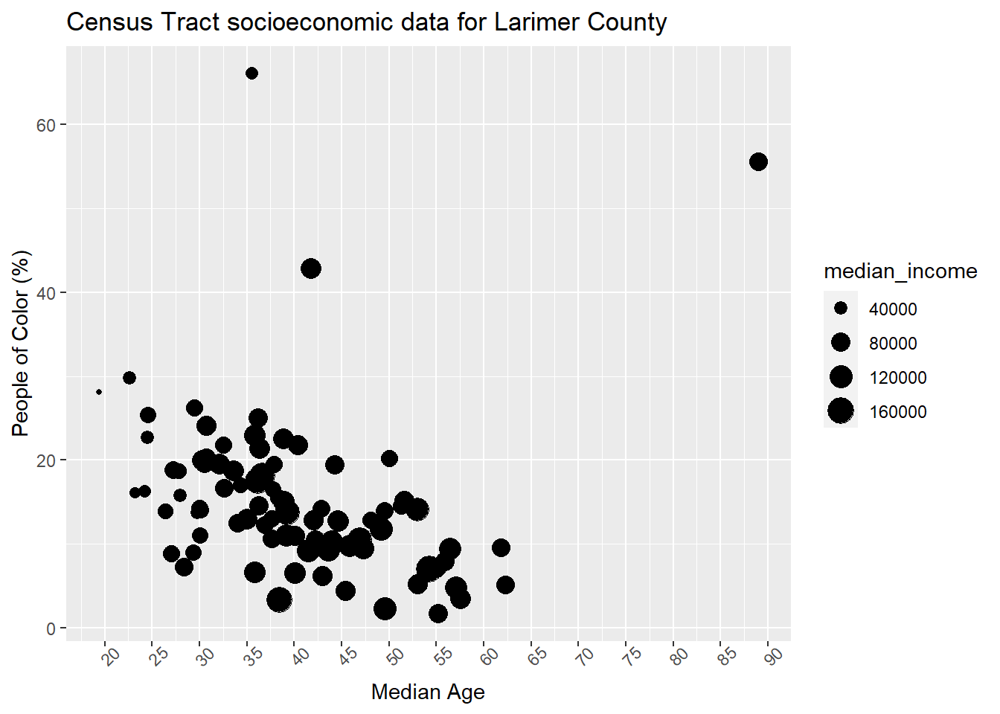
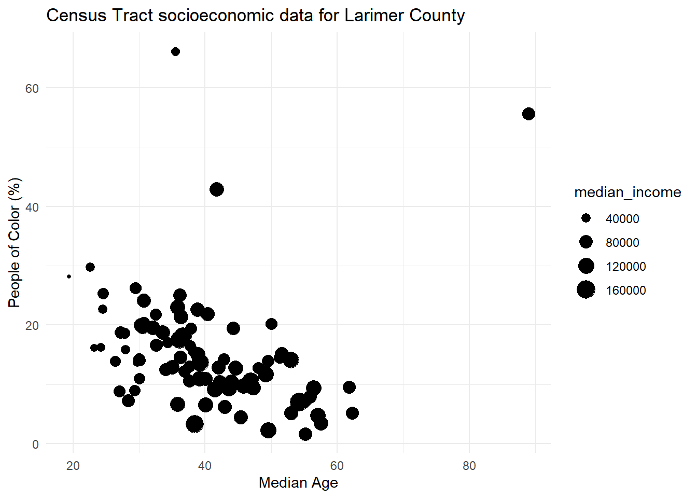
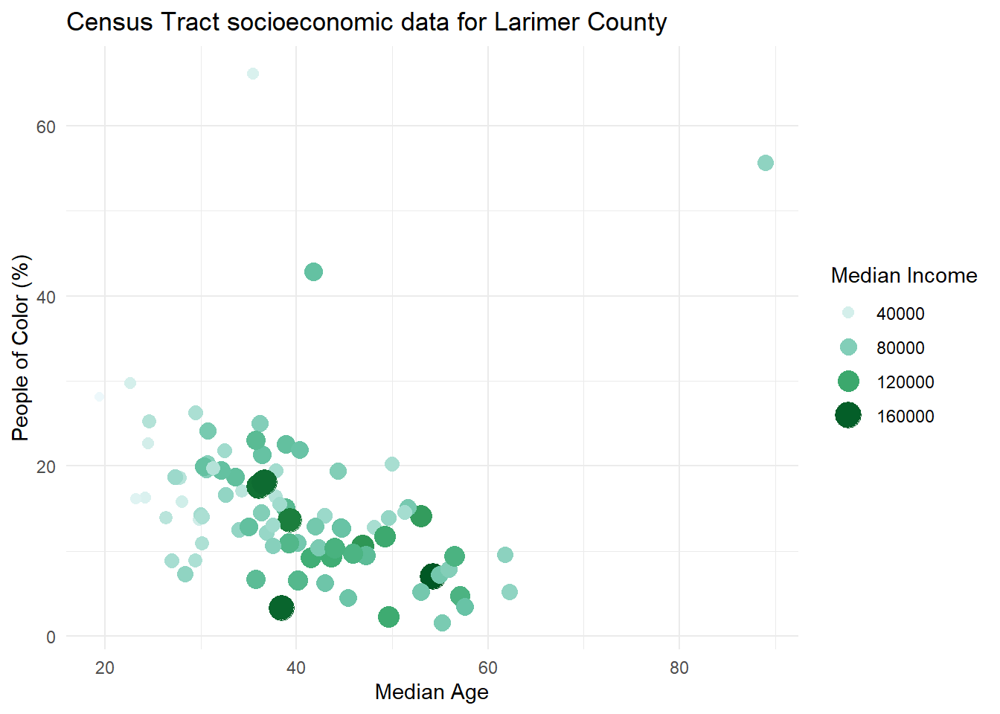

# Data Visualization in R


This lesson will go a little deeper into data visualization and how to customize figures and tables and make them 'publication ready'.

First start by reading in the packages for this lesson, which in this case is only the {tidyverse}:


```r
library(tidyverse)
```

```
## Warning: package 'tidyverse' was built under R version 4.2.3
```

```
## Warning: package 'ggplot2' was built under R version 4.2.3
```

```
## Warning: package 'tibble' was built under R version 4.2.3
```

```
## Warning: package 'tidyr' was built under R version 4.2.3
```

```
## Warning: package 'readr' was built under R version 4.2.3
```

```
## Warning: package 'dplyr' was built under R version 4.2.3
```

```
## Warning: package 'forcats' was built under R version 4.2.3
```

```
## Warning: package 'lubridate' was built under R version 4.2.3
```

### Data Preparation

For today's lesson we are going to be working with some census data for Larimer County, CO. This data can be found on Canvas in .csv format titled `larimer_census.csv`. Download that file and put it in a `data/` folder in the your R Project.

After that, read the .csv into your R session using `read_csv()`:


```r
census_data <- read_csv("data/larimer_census.csv")
```

Inspect `census_data` and the structure of the data frame. This data contains information on median income, median age, and race and ethnicity for each census tract in Larimer County.

::: {.alert .alert-info}
Note: This census data for Larimer county was retrieved entirely in R using the `tidycensus` package. If you are interested in how I did this, I've uploaded the script to do so on Canvas titled 'getCensusData.R'. Note that you will need to retrieve your own census API key and paste it at the top of the script to run it (API keys are free and easy to get [here](https://api.census.gov/data/key_signup.html)). To learn more about `tidycensus`, check out [Analyzing U.S. Census Data](https://walker-data.com/census-r/index.html) by Kyle Walker.
:::

<hr>

## Publication Ready Figures with `ggplot2`

For this exercise you will learn how to spruce up your `ggplot2` figures with theme customization, annotation, color palettes, and more.

To demonstrate some of these advanced visualization techniques, we will be analyzing the relationships among some census data for Larimer county.

Let's start with this basic plot:


```r
census_data %>% 
  ggplot(aes(x = median_age, y = percent_bipoc))+
  geom_point(color = "black")
```


And by the end of this lesson turn it into this:


### General Appearance

#### Customize points within `geom_point()`

-   color or size points by a variable or apply a specific color/number

-   change the transparency with `alpha` (ranges from 0-1)


```r
#specific color and size value
census_data %>% 
  ggplot(aes(x = median_age, y = percent_bipoc))+
  geom_point(color = "red", size = 4, alpha = 0.5)
```


When sizing or coloring points by a variable in the dataset, it goes within `aes():`


```r
# size by a variable
census_data %>% 
  ggplot(aes(x = median_age, y = percent_bipoc))+
  geom_point(aes(size = median_income), color = "red")
```


```r
# color by a variable
census_data %>% 
  ggplot(aes(x = median_age, y = percent_bipoc))+
  geom_point(aes(color = median_income), size = 4)
```


#### Titles and limits

-   add title with `ggtitle`

-   edit axis labels with `xlab()` and `ylab()`

-   change axis limits with `xlim()` and `ylim()`


```r
census_data %>% 
  ggplot(aes(x = median_age, y = percent_bipoc)) +
  geom_point(aes(size = median_income), color = "black")+
  ggtitle("Census Tract socioeconomic data for Larimer County")+
  xlab("Median Age")+
  ylab("People of Color (%)")+
  xlim(c(20, 70))+
  ylim(c(0, 35))
```


Be cautious of setting the axis limits however, as you notice it omits the full dataset which could lead to dangerous misinterpretations of the data.

You can also put multiple label arguments within `labs()` like this:


```r
census_data %>% 
  ggplot(aes(x = median_age, y = percent_bipoc)) +
  geom_point(aes(size = median_income), color = "black")+
  labs(
    title = "Census Tract socioeconomic data for Larimer County",
    x = "Median Age",
    y = "People of Color (%)"
  ) +
  xlim(c(20, 70))+
  ylim(c(0, 35))
```


#### Chart components with `theme()`

All `ggplot2` components can be customized within the `theme()` function. The full list of editable components (there's a lot!) can be found [here](https://ggplot2.tidyverse.org/reference/theme.html). Note that the functions used within `theme()` depend on the type of components, such as `element_text()` for text, `element_line()` for lines, etc.


```r
census_data %>%
  ggplot(aes(x = median_age, y = percent_bipoc)) +
  geom_point(aes(size = median_income), color = "black") +
  ggtitle("Census Tract socioeconomic data for Larimer County") +
  xlab("Median Age") +
  ylab("People of Color (%)") +
  theme(
    #edit plot title
    plot.title = element_text(size = 16, color = "blue"),
    # edit x axis title
    axis.title.x = element_text(face = "italic", color = "orange"),
    # edit y axis ticks
    axis.text.y = element_text(face = "bold"),
    # edit grid lines
    panel.grid.major = element_line(color = "black"),

  )
```


Another change you may want to make is the value breaks in the axis labels (i.e., what values are shown on the axis). To customize that for a continuous variable you can use `scale_x_continuous()` / `scale_y_continuous` (for discrete variables use `scale_x_discrete` ). In this example we will also add `anlge =` to our axis text to angle the labels so they are not too jumbled:


```r
census_data %>%
  ggplot(aes(x = median_age, y = percent_bipoc)) +
  geom_point(aes(size = median_income), color = "black") +
  ggtitle("Census Tract socioeconomic data for Larimer County") +
  xlab("Median Age") +
  ylab("People of Color (%)") +
  scale_x_continuous(breaks = seq(15, 90, 5))+
  theme(
    # angle axis labels
    axis.text.x = element_text(angle = 45)
  )
```



While these edits aren't necessarily *pretty*, we are just demonstrating how you would edit specific components of your charts. To edit overall aesthetics of your plots you can change the theme.

#### Themes

`ggplot2` comes with many built in theme options (see the complete list [here](https://r-graph-gallery.com/192-ggplot-themes)).

For example, see what `theme_minimal()` and `theme_classic()` look like:


```r
census_data %>%
  ggplot(aes(x = median_age, y = percent_bipoc)) +
  geom_point(aes(size = median_income), color = "black") +
  ggtitle("Census Tract socioeconomic data for Larimer County") +
  xlab("Median Age") +
  ylab("People of Color (%)")+
  theme_minimal()
```




```r
census_data %>%
  ggplot(aes(x = median_age, y = percent_bipoc)) +
  geom_point(aes(size = median_income), color = "black") +
  ggtitle("Census Tract socioeconomic data for Larimer County") +
  xlab("Median Age") +
  ylab("People of Color (%)")+
  theme_classic()
```


You can also import many different themes by installing certain packages. A popular one is `ggthemes`. A complete list of themes with this package can be seen [here](https://yutannihilation.github.io/allYourFigureAreBelongToUs/ggthemes/)

To run this example, first install the `ggthemes` package and then load it in to your session:


```r
install.packages("ggthemes")
```


```r
library(ggthemes)
```

Now explore a few themes, such as `theme_wsj`, which uses the Wall Street Journal theme, and `theme_economist` and `theme_economist_white` to use themes used by the Economist.


```r
census_data %>%
  ggplot(aes(x = median_age, y = percent_bipoc)) +
  geom_point(aes(size = median_income), color = "black") +
  ggtitle("Socioeconomic data for Larimer County") +
  xlab("Median Age") +
  ylab("People of Color (%)")+
  ggthemes::theme_wsj()+
  # make the text smaller
  theme(text = element_text(size = 8))
```


::: {.alert .alert-info}
Note you may need to click 'Zoom' in the Plot window to view the figure better.
:::


```r
census_data %>%
  ggplot(aes(x = median_age, y = percent_bipoc)) +
  geom_point(aes(size = median_income), color = "black") +
  ggtitle("Census Tract socioeconomic data for Larimer County") +
  xlab("Median Age") +
  ylab("People of Color (%)")+
  ggthemes::theme_economist()
```


Some themes may look messy out of the box, but you can apply any elements from `theme()` afterwards to clean it up. For example, change the legend position:


```r
census_data %>%
  ggplot(aes(x = median_age, y = percent_bipoc)) +
  geom_point(aes(size = median_income), color = "black") +
  ggtitle("Census Tract socioeconomic data for Larimer County") +
  xlab("Median Age") +
  ylab("People of Color (%)")+
  ggthemes::theme_economist()+
  theme(
    legend.position = "bottom"
  )
```


### Color, Size and Legends

#### Color

To specify a single color, the most common way is to specify the name (e.g., `"red"`) or the Hex code (e.g., `"#69b3a2"`).

You can also specify an entire color palette. Some of the most common packages to work with color palettes in R are `RColorBrewer` and [`viridis`](https://cran.r-project.org/web/packages/viridis/vignettes/intro-to-viridis.html). Viridis is designed to be color-blind friendly, and RColorBrewer has a [web application](https://colorbrewer2.org/#type=sequential&scheme=BuGn&n=3) where you can explore your data requirements and preview various palettes.

First, if you want to run these examples install and load the `RColorBrewer` and `viridis` packages:


```r
install.packages("RColorBrewer")
install.packages("viridis")
```


```r
library(RColorBrewer)
library(viridis)
```

Now, lets color our points using the palettes in `viridis`. To customize continuous color scales with `viridis` we use `scale_color_viridis()`.


```r
census_data %>%
  ggplot(aes(x = median_age, y = percent_bipoc)) +
  geom_point(aes(size = median_income, color = median_income)) +
  ggtitle("Census Tract socioeconomic data for Larimer County") +
  xlab("Median Age") +
  ylab("People of Color (%)")+
  viridis::scale_colour_viridis()
```


Second, let's see how to do that with an `RColorBrewer` palette, using the 'Greens' palette and `scale_color_distiller()` function. We add `direction = 1` to make it so that darker green is associated with higher values for income.


```r
census_data %>%
  ggplot(aes(x = median_age, y = percent_bipoc)) +
  geom_point(aes(size = median_income, color = median_income)) +
  ggtitle("Census Tract socioeconomic data for Larimer County") +
  xlab("Median Age") +
  ylab("People of Color (%)")+
  scale_color_distiller(palette = "Greens", direction = 1)
```


#### Size

You can edit the range of the point radius with `scale_radius` :


```r
census_data %>%
  ggplot(aes(x = median_age, y = percent_bipoc)) +
  geom_point(aes(size = median_income, color = median_income)) +
  ggtitle("Census Tract socioeconomic data for Larimer County") +
  xlab("Median Age") +
  ylab("People of Color (%)")+
  scale_color_distiller(palette = "Greens", direction = 1)+
  scale_radius(range = c(0.5, 6))
```


#### Legends

In the previous plots we notice that two separate legends are created for size and color. To create one legend where the circles are colored, we use `guides()` like this, specifying the same title for color and size:


```r
census_data %>%
  ggplot(aes(x = median_age, y = percent_bipoc)) +
  geom_point(aes(size = median_income, color = median_income)) +
  ggtitle("Census Tract socioeconomic data for Larimer County") +
  xlab("Median Age") +
  ylab("People of Color (%)")+
  scale_color_distiller(palette = "BuGn", direction = 1)+
  scale_radius(range = c(2, 6))+
  theme_minimal()+
  #customize legend
  guides(color= guide_legend(title = "Median Income"), size=guide_legend(title = "Median Income"))
```



### Annotation

Annotation is the process of adding text, or 'notes' to your charts. Say we wanted to highlight some details to specific points in our data, for example some of the outliers.

When investigating the outlying point with the highest median age and high percentage of people of color, it turns out that census tract includes Rocky Mountain National Park and the surrounding area, and also the total population of that tract is only 53. Lets add these details to our chart with `annotate()`. This function requires several arguments:

-   `geom`: type of annotation, most often `text`

-   `x`: position on the x axis to put the annotation

-   `y`: position on the y axis to put the annotation

-   `label`: what you want the annotation to say

-   Optional: `color`, `size`, `angle`, and more.


```r
census_data %>%
  ggplot(aes(x = median_age, y = percent_bipoc)) +
  geom_point(aes(size = median_income, color = median_income)) +
  ggtitle("Census Tract socioeconomic data for Larimer County") +
  xlab("Median Age") +
  ylab("People of Color (%)")+
  scale_color_distiller(palette = "BuGn", direction = 1)+
  scale_radius(range = c(2, 6))+
  theme_minimal()+
  guides(color= guide_legend(title = "Median Income"), size=guide_legend(title = "Median Income"))+
  # add annotation
  annotate(geom = "text", x=76, y = 62,
           label = "Rocky Mountain National Park region \n Total Populaion: 53")
```


We can also add an arrow to point at the data point the annotation is referring to with `geom_curve` and a few other arguments like so:


```r
census_data %>%
  ggplot(aes(x = median_age, y = percent_bipoc)) +
  geom_point(aes(size = median_income, color = median_income)) +
  ggtitle("Census Tract socioeconomic data for Larimer County") +
  xlab("Median Age") +
  ylab("People of Color (%)") +
  scale_color_distiller(palette = "BuGn", direction = 1) +
  scale_radius(range = c(2, 6)) +
  theme_minimal() +
  guides(color = guide_legend(title = "Median Income"),
         size = guide_legend(title = "Median Income")) +
  annotate(geom = "text",
           x = 74,
           y = 62,
           label = "Rocky Mountain National Park region \n Total Populaion: 53") +
  # add arrow
  geom_curve(
    aes(
      x = 82,
      xend = 88,
      y = 60,
      yend = 57.5
    ),
    arrow = arrow(length = unit(0.2, "cm")),
    size = 0.5,
    curvature = -0.3
  )
```

```
## Warning: Using `size` aesthetic for lines was deprecated in ggplot2 3.4.0.
## ℹ Please use `linewidth` instead.
## This warning is displayed once every 8 hours.
## Call `lifecycle::last_lifecycle_warnings()` to see where this warning was
## generated.
```


::: {.alert .alert-info}
Note that with annotations you may need to mess around with the x and y positions to get it just right. Also, the preview you see in the 'plot' window may look jumbled and viewing it by clicking 'Zoom' can help.
:::

### Finalize and save

We are almost done with this figure. I am going to add/change a few more elements below. Feel free to add your own!


```r
census_data %>%
  ggplot(aes(x = median_age, y = percent_bipoc)) +
  geom_point(aes(size = median_income, color = median_income), alpha = 0.9) +
  labs(
    title = "Socioeconomic data for Larimer County",
    subtitle = "Median age, median income, and percentage of people of color for each census tract",
    x = "Median Age",
    y = "People of Color (%)",
    caption = "Data obtained from the U.S. Census 5-year American Community Survey Samples for 2017-2021"
  )+
  scale_radius(range = c(2, 6)) +
  theme_classic() +
  scale_color_viridis() + #use the Viridis palette
  guides(color = guide_legend(title = "Median Income"),
         size = guide_legend(title = "Median Income")) +
  theme(
    axis.title = element_text(face = "bold", size = 10),
    plot.title = element_text(face = "bold",size = 15, margin = unit(c(1,1,1,1), "cm")),
    plot.subtitle = element_text(size = 10, margin = unit(c(-0.5,0.5,0.5,0.5), "cm")),
    plot.caption = element_text(face = "italic", hjust = -0.2),
    plot.title.position = "plot", #sets the title to the left
    legend.position = "bottom",
    legend.text = element_text(size = 8)
  ) +
  annotate(geom = "text",
           x = 74,
           y = 62,
           label = "Rocky Mountain National Park region \n Total Populaion: 53",
           size = 3,
           color = "black") +
  geom_curve(
    aes(
      x = 82,
      xend = 88,
      y = 60,
      yend = 57.5
    ),
    arrow = arrow(length = unit(0.2, "cm")),
    size = 0.5,
    color = "black",
    curvature = -0.3
  )
```


**Want to make it dark theme?**

`ggdark` is a fun package to easily convert your figures to various dark themes. If you want to test it out, install the package and try `dark_theme_classic()` instead of `theme_classic()` in the previous figure:


```r
install.packages("ggdark")
```


```r
library(ggdark)
```


```r
census_data %>%
  ggplot(aes(x = median_age, y = percent_bipoc)) +
  geom_point(aes(size = median_income, color = median_income), alpha = 0.9) +
  labs(
    title = "Socioeconomic data for Larimer County",
    subtitle = "Median age, median income, and percentage of people of color for each census tract",
    x = "Median Age",
    y = "People of Color (%)",
    caption = "Data obtained from the U.S. Census 5-year American Community Survey Samples for 2017-2021"
  )+
  scale_radius(range = c(2, 6)) +
  dark_theme_classic() +
  scale_color_viridis() + #use the Viridis palette
  guides(color = guide_legend(title = "Median Income"),
         size = guide_legend(title = "Median Income")) +
  theme(
    axis.title = element_text(face = "bold", size = 10),
    plot.title = element_text(face = "bold",size = 15, margin = unit(c(1,1,1,1), "cm")),
    plot.subtitle = element_text(size = 10, margin = unit(c(-0.5,0.5,0.5,0.5), "cm")),
    plot.caption = element_text(face = "italic", hjust = -0.2),
    plot.title.position = "plot", #sets the title to the left
    legend.position = "bottom",
    legend.text = element_text(size = 8)
  ) +
  annotate(geom = "text",
           x = 74,
           y = 62,
           label = "Rocky Mountain National Park region \n Total Populaion: 53",
           size = 3) +
  geom_curve(
    aes(
      x = 82,
      xend = 88,
      y = 60,
      yend = 57.5
    ),
    arrow = arrow(length = unit(0.2, "cm")),
    size = 0.5,
    curvature = -0.3
  )
```


**Saving with `ggsave`**

You can save your plot in the "Plots" pane by clicking "Export", or you can also do it programmatically with `ggsave()`, which also lets you customize the output file a little more. Note that you can give the argument a variable name of a ggplot object, or **by default it will save the last plot in the "Plots" pane**.


```r
#specify the file path and name, and height/width (if necessary)
ggsave(filename = "data/census_plot.png", width = 6, height = 5, units = "in")
```

#### Want to make it interactive?

The `plotly` package and the `ggplotly()` function lets you make your charts interactive.


```r
install.packages("plotly")
```


```r
library(plotly)
```

We can put our entire ggplot code above inside `ggplotly()` below to make it interactive:


```r
ggplotly(census_data %>%
  ggplot(aes(x = median_age, y = percent_bipoc)) +
  geom_point(aes(size = median_income, color = median_income), alpha = 0.9) +
  labs(
    title = "Socioeconomic data for Larimer County",
    subtitle = "Median age, median income, and percentage of people of color for each census tract",
    x = "Median Age",
    y = "People of Color (%)",
    caption = "Data obtained from the U.S. Census 5-year American Community Survey Samples for 2017-2021"
  )+
  scale_radius(range = c(2, 6)) +
  dark_theme_classic() +
  scale_color_viridis() + #use the Viridis palette
  guides(color = guide_legend(title = "Median Income"),
         size = guide_legend(title = "Median Income")) +
  theme(
    axis.title = element_text(face = "bold", size = 10),
    plot.title = element_text(face = "bold",size = 15, margin = unit(c(1,1,1,1), "cm")),
    plot.subtitle = element_text(size = 10, margin = unit(c(-0.5,0.5,0.5,0.5), "cm")),
    plot.caption = element_text(face = "italic", hjust = -0.2),
    plot.title.position = "plot", #sets the title to the left
    legend.position = "bottom",
    legend.text = element_text(size = 8)
  ))
```

```{=html}
<div class="plotly html-widget html-fill-item-overflow-hidden html-fill-item" id="htmlwidget-6759bf825bed4ae5849c" style="width:672px;height:480px;"></div>
<script type="application/json" data-for="htmlwidget-6759bf825bed4ae5849c">{"x":{"data":[{"x":[47.3],"y":[9.46184738955823],"text":"median_age: 47.3<br />percent_bipoc:  9.461847<br />median_income:  99213<br />median_income:  99213","type":"scatter","mode":"markers","marker":{"autocolorscale":false,"color":"rgba(30,156,137,1)","opacity":0.9,"size":15.843024777825,"symbol":"circle","line":{"width":1.88976377952756,"color":"rgba(30,156,137,1)"}},"hoveron":"points","showlegend":false,"xaxis":"x","yaxis":"y","hoverinfo":"text","frame":null},{"x":[35.8],"y":[6.68355416991426],"text":"median_age: 35.8<br />percent_bipoc:  6.683554<br />median_income:  99531<br />median_income:  99531","type":"scatter","mode":"markers","marker":{"autocolorscale":false,"color":"rgba(30,156,137,1)","opacity":0.9,"size":15.8772142956938,"symbol":"circle","line":{"width":1.88976377952756,"color":"rgba(30,156,137,1)"}},"hoveron":"points","showlegend":false,"xaxis":"x","yaxis":"y","hoverinfo":"text","frame":null},{"x":[38.9],"y":[22.5527426160338],"text":"median_age: 38.9<br />percent_bipoc: 22.552743<br />median_income:  94844<br />median_income:  94844","type":"scatter","mode":"markers","marker":{"autocolorscale":false,"color":"rgba(31,148,140,1)","opacity":0.9,"size":15.3732952068543,"symbol":"circle","line":{"width":1.88976377952756,"color":"rgba(31,148,140,1)"}},"hoveron":"points","showlegend":false,"xaxis":"x","yaxis":"y","hoverinfo":"text","frame":null},{"x":[35],"y":[12.9088378566458],"text":"median_age: 35.0<br />percent_bipoc: 12.908838<br />median_income:  95115<br />median_income:  95115","type":"scatter","mode":"markers","marker":{"autocolorscale":false,"color":"rgba(31,148,140,1)","opacity":0.9,"size":15.4024315569877,"symbol":"circle","line":{"width":1.88976377952756,"color":"rgba(31,148,140,1)"}},"hoveron":"points","showlegend":false,"xaxis":"x","yaxis":"y","hoverinfo":"text","frame":null},{"x":[44.6],"y":[12.7721335268505],"text":"median_age: 44.6<br />percent_bipoc: 12.772134<br />median_income:  95938<br />median_income:  95938","type":"scatter","mode":"markers","marker":{"autocolorscale":false,"color":"rgba(31,150,139,1)","opacity":0.9,"size":15.4909157494594,"symbol":"circle","line":{"width":1.88976377952756,"color":"rgba(31,150,139,1)"}},"hoveron":"points","showlegend":false,"xaxis":"x","yaxis":"y","hoverinfo":"text","frame":null},{"x":[33.6],"y":[18.737565563393],"text":"median_age: 33.6<br />percent_bipoc: 18.737566<br />median_income:  95962<br />median_income:  95962","type":"scatter","mode":"markers","marker":{"autocolorscale":false,"color":"rgba(31,150,139,1)","opacity":0.9,"size":15.4934960904306,"symbol":"circle","line":{"width":1.88976377952756,"color":"rgba(31,150,139,1)"}},"hoveron":"points","showlegend":false,"xaxis":"x","yaxis":"y","hoverinfo":"text","frame":null},{"x":[35.8],"y":[22.973281571135],"text":"median_age: 35.8<br />percent_bipoc: 22.973282<br />median_income: 100789<br />median_income: 100789","type":"scatter","mode":"markers","marker":{"autocolorscale":false,"color":"rgba(31,159,136,1)","opacity":0.9,"size":16.012467168269,"symbol":"circle","line":{"width":1.88976377952756,"color":"rgba(31,159,136,1)"}},"hoveron":"points","showlegend":false,"xaxis":"x","yaxis":"y","hoverinfo":"text","frame":null},{"x":[38.9],"y":[15.0260352095214],"text":"median_age: 38.9<br />percent_bipoc: 15.026035<br />median_income: 101419<br />median_income: 101419","type":"scatter","mode":"markers","marker":{"autocolorscale":false,"color":"rgba(31,160,136,1)","opacity":0.9,"size":16.0802011187637,"symbol":"circle","line":{"width":1.88976377952756,"color":"rgba(31,160,136,1)"}},"hoveron":"points","showlegend":false,"xaxis":"x","yaxis":"y","hoverinfo":"text","frame":null},{"x":[41.8],"y":[42.8230805913209],"text":"median_age: 41.8<br />percent_bipoc: 42.823081<br />median_income:  93600<br />median_income:  93600","type":"scatter","mode":"markers","marker":{"autocolorscale":false,"color":"rgba(32,146,140,1)","opacity":0.9,"size":15.2395475331789,"symbol":"circle","line":{"width":1.88976377952756,"color":"rgba(32,146,140,1)"}},"hoveron":"points","showlegend":false,"xaxis":"x","yaxis":"y","hoverinfo":"text","frame":null},{"x":[30.3],"y":[19.944232462577],"text":"median_age: 30.3<br />percent_bipoc: 19.944232<br />median_income:  94087<br />median_income:  94087","type":"scatter","mode":"markers","marker":{"autocolorscale":false,"color":"rgba(32,146,140,1)","opacity":0.9,"size":15.2919069520534,"symbol":"circle","line":{"width":1.88976377952756,"color":"rgba(32,146,140,1)"}},"hoveron":"points","showlegend":false,"xaxis":"x","yaxis":"y","hoverinfo":"text","frame":null},{"x":[32.1],"y":[19.4771241830065],"text":"median_age: 32.1<br />percent_bipoc: 19.477124<br />median_income:  94110<br />median_income:  94110","type":"scatter","mode":"markers","marker":{"autocolorscale":false,"color":"rgba(32,146,140,1)","opacity":0.9,"size":15.2943797788175,"symbol":"circle","line":{"width":1.88976377952756,"color":"rgba(32,146,140,1)"}},"hoveron":"points","showlegend":false,"xaxis":"x","yaxis":"y","hoverinfo":"text","frame":null},{"x":[40.1],"y":[6.54911838790932],"text":"median_age: 40.1<br />percent_bipoc:  6.549118<br />median_income: 104006<br />median_income: 104006","type":"scatter","mode":"markers","marker":{"autocolorscale":false,"color":"rgba(32,163,134,1)","opacity":0.9,"size":16.3583403726207,"symbol":"circle","line":{"width":1.88976377952756,"color":"rgba(32,163,134,1)"}},"hoveron":"points","showlegend":false,"xaxis":"x","yaxis":"y","hoverinfo":"text","frame":null},{"x":[40.4],"y":[21.8319886093972],"text":"median_age: 40.4<br />percent_bipoc: 21.831989<br />median_income:  91071<br />median_income:  91071","type":"scatter","mode":"markers","marker":{"autocolorscale":false,"color":"rgba(33,142,141,1)","opacity":0.9,"size":14.9676441033357,"symbol":"circle","line":{"width":1.88976377952756,"color":"rgba(33,142,141,1)"}},"hoveron":"points","showlegend":false,"xaxis":"x","yaxis":"y","hoverinfo":"text","frame":null},{"x":[57.6],"y":[3.43110127282789],"text":"median_age: 57.6<br />percent_bipoc:  3.431101<br />median_income:  91404<br />median_income:  91404","type":"scatter","mode":"markers","marker":{"autocolorscale":false,"color":"rgba(33,143,141,1)","opacity":0.9,"size":15.0034463343115,"symbol":"circle","line":{"width":1.88976377952756,"color":"rgba(33,143,141,1)"}},"hoveron":"points","showlegend":false,"xaxis":"x","yaxis":"y","hoverinfo":"text","frame":null},{"x":[44.7],"y":[12.6859928168291],"text":"median_age: 44.7<br />percent_bipoc: 12.685993<br />median_income:  91677<br />median_income:  91677","type":"scatter","mode":"markers","marker":{"autocolorscale":false,"color":"rgba(33,143,141,1)","opacity":0.9,"size":15.0327977128592,"symbol":"circle","line":{"width":1.88976377952756,"color":"rgba(33,143,141,1)"}},"hoveron":"points","showlegend":false,"xaxis":"x","yaxis":"y","hoverinfo":"text","frame":null},{"x":[36.4],"y":[21.3188798554652],"text":"median_age: 36.4<br />percent_bipoc: 21.318880<br />median_income:  92765<br />median_income:  92765","type":"scatter","mode":"markers","marker":{"autocolorscale":false,"color":"rgba(33,145,140,1)","opacity":0.9,"size":15.1497731702216,"symbol":"circle","line":{"width":1.88976377952756,"color":"rgba(33,145,140,1)"}},"hoveron":"points","showlegend":false,"xaxis":"x","yaxis":"y","hoverinfo":"text","frame":null},{"x":[45.4],"y":[4.45109407144193],"text":"median_age: 45.4<br />percent_bipoc:  4.451094<br />median_income:  89684<br />median_income:  89684","type":"scatter","mode":"markers","marker":{"autocolorscale":false,"color":"rgba(34,139,141,1)","opacity":0.9,"size":14.8185218980401,"symbol":"circle","line":{"width":1.88976377952756,"color":"rgba(34,139,141,1)"}},"hoveron":"points","showlegend":false,"xaxis":"x","yaxis":"y","hoverinfo":"text","frame":null},{"x":[39.2],"y":[10.960960960961],"text":"median_age: 39.2<br />percent_bipoc: 10.960961<br />median_income: 105708<br />median_income: 105708","type":"scatter","mode":"markers","marker":{"autocolorscale":false,"color":"rgba(34,167,133,1)","opacity":0.9,"size":16.5413295531637,"symbol":"circle","line":{"width":1.88976377952756,"color":"rgba(34,167,133,1)"}},"hoveron":"points","showlegend":false,"xaxis":"x","yaxis":"y","hoverinfo":"text","frame":null},{"x":[43],"y":[6.19286346210557],"text":"median_age: 43.0<br />percent_bipoc:  6.192863<br />median_income:  89000<br />median_income:  89000","type":"scatter","mode":"markers","marker":{"autocolorscale":false,"color":"rgba(35,138,141,1)","opacity":0.9,"size":14.7449821803601,"symbol":"circle","line":{"width":1.88976377952756,"color":"rgba(35,138,141,1)"}},"hoveron":"points","showlegend":false,"xaxis":"x","yaxis":"y","hoverinfo":"text","frame":null},{"x":[42],"y":[12.8602663486384],"text":"median_age: 42.0<br />percent_bipoc: 12.860266<br />median_income:  86413<br />median_income:  86413","type":"scatter","mode":"markers","marker":{"autocolorscale":false,"color":"rgba(36,134,142,1)","opacity":0.9,"size":14.4668429265031,"symbol":"circle","line":{"width":1.88976377952756,"color":"rgba(36,134,142,1)"}},"hoveron":"points","showlegend":false,"xaxis":"x","yaxis":"y","hoverinfo":"text","frame":null},{"x":[55],"y":[7.21816707218167],"text":"median_age: 55.0<br />percent_bipoc:  7.218167<br />median_income:  86802<br />median_income:  86802","type":"scatter","mode":"markers","marker":{"autocolorscale":false,"color":"rgba(36,134,142,1)","opacity":0.9,"size":14.5086659530784,"symbol":"circle","line":{"width":1.88976377952756,"color":"rgba(36,134,142,1)"}},"hoveron":"points","showlegend":false,"xaxis":"x","yaxis":"y","hoverinfo":"text","frame":null},{"x":[51.6],"y":[15.1875571820677],"text":"median_age: 51.6<br />percent_bipoc: 15.187557<br />median_income:  84808<br />median_income:  84808","type":"scatter","mode":"markers","marker":{"autocolorscale":false,"color":"rgba(37,131,142,1)","opacity":0.9,"size":14.2942826240522,"symbol":"circle","line":{"width":1.88976377952756,"color":"rgba(37,131,142,1)"}},"hoveron":"points","showlegend":false,"xaxis":"x","yaxis":"y","hoverinfo":"text","frame":null},{"x":[53],"y":[5.18301610541728],"text":"median_age: 53.0<br />percent_bipoc:  5.183016<br />median_income:  85929<br />median_income:  85929","type":"scatter","mode":"markers","marker":{"autocolorscale":false,"color":"rgba(37,133,142,1)","opacity":0.9,"size":14.41480605025,"symbol":"circle","line":{"width":1.88976377952756,"color":"rgba(37,133,142,1)"}},"hoveron":"points","showlegend":false,"xaxis":"x","yaxis":"y","hoverinfo":"text","frame":null},{"x":[40.1],"y":[10.9748224661072],"text":"median_age: 40.1<br />percent_bipoc: 10.974822<br />median_income:  86319<br />median_income:  86319","type":"scatter","mode":"markers","marker":{"autocolorscale":false,"color":"rgba(37,133,142,1)","opacity":0.9,"size":14.4567365910325,"symbol":"circle","line":{"width":1.88976377952756,"color":"rgba(37,133,142,1)"}},"hoveron":"points","showlegend":false,"xaxis":"x","yaxis":"y","hoverinfo":"text","frame":null},{"x":[55.2],"y":[1.64271047227926],"text":"median_age: 55.2<br />percent_bipoc:  1.642710<br />median_income:  83438<br />median_income:  83438","type":"scatter","mode":"markers","marker":{"autocolorscale":false,"color":"rgba(38,129,142,1)","opacity":0.9,"size":14.1469881602779,"symbol":"circle","line":{"width":1.88976377952756,"color":"rgba(38,129,142,1)"}},"hoveron":"points","showlegend":false,"xaxis":"x","yaxis":"y","hoverinfo":"text","frame":null},{"x":[42.3],"y":[10.4175824175824],"text":"median_age: 42.3<br />percent_bipoc: 10.417582<br />median_income:  83555<br />median_income:  83555","type":"scatter","mode":"markers","marker":{"autocolorscale":false,"color":"rgba(38,129,142,1)","opacity":0.9,"size":14.1595673225127,"symbol":"circle","line":{"width":1.88976377952756,"color":"rgba(38,129,142,1)"}},"hoveron":"points","showlegend":false,"xaxis":"x","yaxis":"y","hoverinfo":"text","frame":null},{"x":[30.7],"y":[24.1459029026458],"text":"median_age: 30.7<br />percent_bipoc: 24.145903<br />median_income:  84475<br />median_income:  84475","type":"scatter","mode":"markers","marker":{"autocolorscale":false,"color":"rgba(38,130,142,1)","opacity":0.9,"size":14.2584803930764,"symbol":"circle","line":{"width":1.88976377952756,"color":"rgba(38,130,142,1)"}},"hoveron":"points","showlegend":false,"xaxis":"x","yaxis":"y","hoverinfo":"text","frame":null},{"x":[45.9],"y":[9.72674855853597],"text":"median_age: 45.9<br />percent_bipoc:  9.726749<br />median_income: 109258<br />median_income: 109258","type":"scatter","mode":"markers","marker":{"autocolorscale":false,"color":"rgba(38,173,129,1)","opacity":0.9,"size":16.9230049884912,"symbol":"circle","line":{"width":1.88976377952756,"color":"rgba(38,173,129,1)"}},"hoveron":"points","showlegend":false,"xaxis":"x","yaxis":"y","hoverinfo":"text","frame":null},{"x":[57.1],"y":[4.74368783473604],"text":"median_age: 57.1<br />percent_bipoc:  4.743688<br />median_income: 109583<br />median_income: 109583","type":"scatter","mode":"markers","marker":{"autocolorscale":false,"color":"rgba(39,173,129,1)","opacity":0.9,"size":16.9579471058099,"symbol":"circle","line":{"width":1.88976377952756,"color":"rgba(39,173,129,1)"}},"hoveron":"points","showlegend":false,"xaxis":"x","yaxis":"y","hoverinfo":"text","frame":null},{"x":[56.5],"y":[9.40451745379877],"text":"median_age: 56.5<br />percent_bipoc:  9.404517<br />median_income: 110227<br />median_income: 110227","type":"scatter","mode":"markers","marker":{"autocolorscale":false,"color":"rgba(40,174,128,1)","opacity":0.9,"size":17.0271862552046,"symbol":"circle","line":{"width":1.88976377952756,"color":"rgba(40,174,128,1)"}},"hoveron":"points","showlegend":false,"xaxis":"x","yaxis":"y","hoverinfo":"text","frame":null},{"x":[36.2],"y":[25],"text":"median_age: 36.2<br />percent_bipoc: 25.000000<br />median_income:  79304<br />median_income:  79304","type":"scatter","mode":"markers","marker":{"autocolorscale":false,"color":"rgba(41,122,142,1)","opacity":0.9,"size":13.7025244279838,"symbol":"circle","line":{"width":1.88976377952756,"color":"rgba(41,122,142,1)"}},"hoveron":"points","showlegend":false,"xaxis":"x","yaxis":"y","hoverinfo":"text","frame":null},{"x":[30.6],"y":[19.5910169800986],"text":"median_age: 30.6<br />percent_bipoc: 19.591017<br />median_income:  79398<br />median_income:  79398","type":"scatter","mode":"markers","marker":{"autocolorscale":false,"color":"rgba(41,122,142,1)","opacity":0.9,"size":13.7126307634545,"symbol":"circle","line":{"width":1.88976377952756,"color":"rgba(41,122,142,1)"}},"hoveron":"points","showlegend":false,"xaxis":"x","yaxis":"y","hoverinfo":"text","frame":null},{"x":[55.9],"y":[7.87545787545788],"text":"median_age: 55.9<br />percent_bipoc:  7.875458<br />median_income:  79697<br />median_income:  79697","type":"scatter","mode":"markers","marker":{"autocolorscale":false,"color":"rgba(41,122,142,1)","opacity":0.9,"size":13.7447775113877,"symbol":"circle","line":{"width":1.88976377952756,"color":"rgba(41,122,142,1)"}},"hoveron":"points","showlegend":false,"xaxis":"x","yaxis":"y","hoverinfo":"text","frame":null},{"x":[36.3],"y":[14.5723601705543],"text":"median_age: 36.3<br />percent_bipoc: 14.572360<br />median_income:  80074<br />median_income:  80074","type":"scatter","mode":"markers","marker":{"autocolorscale":false,"color":"rgba(41,123,142,1)","opacity":0.9,"size":13.7853103674774,"symbol":"circle","line":{"width":1.88976377952756,"color":"rgba(41,123,142,1)"}},"hoveron":"points","showlegend":false,"xaxis":"x","yaxis":"y","hoverinfo":"text","frame":null},{"x":[44.3],"y":[19.4259012016021],"text":"median_age: 44.3<br />percent_bipoc: 19.425901<br />median_income:  80107<br />median_income:  80107","type":"scatter","mode":"markers","marker":{"autocolorscale":false,"color":"rgba(41,123,142,1)","opacity":0.9,"size":13.7888583363128,"symbol":"circle","line":{"width":1.88976377952756,"color":"rgba(41,123,142,1)"}},"hoveron":"points","showlegend":false,"xaxis":"x","yaxis":"y","hoverinfo":"text","frame":null},{"x":[44],"y":[10.3042198233562],"text":"median_age: 44.0<br />percent_bipoc: 10.304220<br />median_income: 111071<br />median_income: 111071","type":"scatter","mode":"markers","marker":{"autocolorscale":false,"color":"rgba(41,175,127,1)","opacity":0.9,"size":17.1179282460261,"symbol":"circle","line":{"width":1.88976377952756,"color":"rgba(41,175,127,1)"}},"hoveron":"points","showlegend":false,"xaxis":"x","yaxis":"y","hoverinfo":"text","frame":null},{"x":[37.6],"y":[10.6115542663766],"text":"median_age: 37.6<br />percent_bipoc: 10.611554<br />median_income:  77426<br />median_income:  77426","type":"scatter","mode":"markers","marker":{"autocolorscale":false,"color":"rgba(42,118,142,1)","opacity":0.9,"size":13.5006127469852,"symbol":"circle","line":{"width":1.88976377952756,"color":"rgba(42,118,142,1)"}},"hoveron":"points","showlegend":false,"xaxis":"x","yaxis":"y","hoverinfo":"text","frame":null},{"x":[30.7],"y":[20.3195854027208],"text":"median_age: 30.7<br />percent_bipoc: 20.319585<br />median_income:  77500<br />median_income:  77500","type":"scatter","mode":"markers","marker":{"autocolorscale":false,"color":"rgba(42,118,142,1)","opacity":0.9,"size":13.5085687983131,"symbol":"circle","line":{"width":1.88976377952756,"color":"rgba(42,118,142,1)"}},"hoveron":"points","showlegend":false,"xaxis":"x","yaxis":"y","hoverinfo":"text","frame":null},{"x":[61.8],"y":[9.54344624447717],"text":"median_age: 61.8<br />percent_bipoc:  9.543446<br />median_income:  75481<br />median_income:  75481","type":"scatter","mode":"markers","marker":{"autocolorscale":false,"color":"rgba(44,115,142,1)","opacity":0.9,"size":13.2914976141086,"symbol":"circle","line":{"width":1.88976377952756,"color":"rgba(44,115,142,1)"}},"hoveron":"points","showlegend":false,"xaxis":"x","yaxis":"y","hoverinfo":"text","frame":null},{"x":[28.4],"y":[7.23871492476616],"text":"median_age: 28.4<br />percent_bipoc:  7.238715<br />median_income:  73361<br />median_income:  73361","type":"scatter","mode":"markers","marker":{"autocolorscale":false,"color":"rgba(45,112,142,1)","opacity":0.9,"size":13.0635674949834,"symbol":"circle","line":{"width":1.88976377952756,"color":"rgba(45,112,142,1)"}},"hoveron":"points","showlegend":false,"xaxis":"x","yaxis":"y","hoverinfo":"text","frame":null},{"x":[62.3],"y":[5.16556291390728],"text":"median_age: 62.3<br />percent_bipoc:  5.165563<br />median_income:  73419<br />median_income:  73419","type":"scatter","mode":"markers","marker":{"autocolorscale":false,"color":"rgba(45,112,142,1)","opacity":0.9,"size":13.0698033189972,"symbol":"circle","line":{"width":1.88976377952756,"color":"rgba(45,112,142,1)"}},"hoveron":"points","showlegend":false,"xaxis":"x","yaxis":"y","hoverinfo":"text","frame":null},{"x":[89],"y":[55.5555555555556],"text":"median_age: 89.0<br />percent_bipoc: 55.555556<br />median_income:  74034<br />median_income:  74034","type":"scatter","mode":"markers","marker":{"autocolorscale":false,"color":"rgba(45,113,142,1)","opacity":0.9,"size":13.1359245563849,"symbol":"circle","line":{"width":1.88976377952756,"color":"rgba(45,113,142,1)"}},"hoveron":"points","showlegend":false,"xaxis":"x","yaxis":"y","hoverinfo":"text","frame":null},{"x":[34],"y":[12.4867724867725],"text":"median_age: 34.0<br />percent_bipoc: 12.486772<br />median_income:  72083<br />median_income:  72083","type":"scatter","mode":"markers","marker":{"autocolorscale":false,"color":"rgba(46,110,142,1)","opacity":0.9,"size":12.9261643382655,"symbol":"circle","line":{"width":1.88976377952756,"color":"rgba(46,110,142,1)"}},"hoveron":"points","showlegend":false,"xaxis":"x","yaxis":"y","hoverinfo":"text","frame":null},{"x":[32.6],"y":[16.6341272940258],"text":"median_age: 32.6<br />percent_bipoc: 16.634127<br />median_income:  72292<br />median_income:  72292","type":"scatter","mode":"markers","marker":{"autocolorscale":false,"color":"rgba(46,110,142,1)","opacity":0.9,"size":12.9486348075566,"symbol":"circle","line":{"width":1.88976377952756,"color":"rgba(46,110,142,1)"}},"hoveron":"points","showlegend":false,"xaxis":"x","yaxis":"y","hoverinfo":"text","frame":null},{"x":[49.6],"y":[13.920046016681],"text":"median_age: 49.6<br />percent_bipoc: 13.920046<br />median_income:  71406<br />median_income:  71406","type":"scatter","mode":"markers","marker":{"autocolorscale":false,"color":"rgba(47,108,142,1)","opacity":0.9,"size":12.8533772200354,"symbol":"circle","line":{"width":1.88976377952756,"color":"rgba(47,108,142,1)"}},"hoveron":"points","showlegend":false,"xaxis":"x","yaxis":"y","hoverinfo":"text","frame":null},{"x":[36.9],"y":[12.2115546572343],"text":"median_age: 36.9<br />percent_bipoc: 12.211555<br />median_income:  70230<br />median_income:  70230","type":"scatter","mode":"markers","marker":{"autocolorscale":false,"color":"rgba(48,106,142,1)","opacity":0.9,"size":12.7269405124452,"symbol":"circle","line":{"width":1.88976377952756,"color":"rgba(48,106,142,1)"}},"hoveron":"points","showlegend":false,"xaxis":"x","yaxis":"y","hoverinfo":"text","frame":null},{"x":[27.3],"y":[18.745247148289],"text":"median_age: 27.3<br />percent_bipoc: 18.745247<br />median_income:  67670<br />median_income:  67670","type":"scatter","mode":"markers","marker":{"autocolorscale":false,"color":"rgba(49,102,142,1)","opacity":0.9,"size":12.4517041421808,"symbol":"circle","line":{"width":1.88976377952756,"color":"rgba(49,102,142,1)"}},"hoveron":"points","showlegend":false,"xaxis":"x","yaxis":"y","hoverinfo":"text","frame":null},{"x":[42.9],"y":[14.165149760053],"text":"median_age: 42.9<br />percent_bipoc: 14.165150<br />median_income:  68359<br />median_income:  68359","type":"scatter","mode":"markers","marker":{"autocolorscale":false,"color":"rgba(49,103,142,1)","opacity":0.9,"size":12.5257814308965,"symbol":"circle","line":{"width":1.88976377952756,"color":"rgba(49,103,142,1)"}},"hoveron":"points","showlegend":false,"xaxis":"x","yaxis":"y","hoverinfo":"text","frame":null},{"x":[37.6],"y":[13.0434782608696],"text":"median_age: 37.6<br />percent_bipoc: 13.043478<br />median_income:  65726<br />median_income:  65726","type":"scatter","mode":"markers","marker":{"autocolorscale":false,"color":"rgba(51,98,141,1)","opacity":0.9,"size":12.2426965235113,"symbol":"circle","line":{"width":1.88976377952756,"color":"rgba(51,98,141,1)"}},"hoveron":"points","showlegend":false,"xaxis":"x","yaxis":"y","hoverinfo":"text","frame":null},{"x":[32.5],"y":[21.7688575209528],"text":"median_age: 32.5<br />percent_bipoc: 21.768858<br />median_income:  65786<br />median_income:  65786","type":"scatter","mode":"markers","marker":{"autocolorscale":false,"color":"rgba(51,98,141,1)","opacity":0.9,"size":12.2491473759394,"symbol":"circle","line":{"width":1.88976377952756,"color":"rgba(51,98,141,1)"}},"hoveron":"points","showlegend":false,"xaxis":"x","yaxis":"y","hoverinfo":"text","frame":null},{"x":[38.3],"y":[15.4713940370669],"text":"median_age: 38.3<br />percent_bipoc: 15.471394<br />median_income:  66047<br />median_income:  66047","type":"scatter","mode":"markers","marker":{"autocolorscale":false,"color":"rgba(51,99,141,1)","opacity":0.9,"size":12.2772085840015,"symbol":"circle","line":{"width":1.88976377952756,"color":"rgba(51,99,141,1)"}},"hoveron":"points","showlegend":false,"xaxis":"x","yaxis":"y","hoverinfo":"text","frame":null},{"x":[30],"y":[14.2926829268293],"text":"median_age: 30.0<br />percent_bipoc: 14.292683<br />median_income:  64415<br />median_income:  64415","type":"scatter","mode":"markers","marker":{"autocolorscale":false,"color":"rgba(52,96,141,1)","opacity":0.9,"size":12.101745397958,"symbol":"circle","line":{"width":1.88976377952756,"color":"rgba(52,96,141,1)"}},"hoveron":"points","showlegend":false,"xaxis":"x","yaxis":"y","hoverinfo":"text","frame":null},{"x":[37.9],"y":[19.4548872180451],"text":"median_age: 37.9<br />percent_bipoc: 19.454887<br />median_income:  64601<br />median_income:  64601","type":"scatter","mode":"markers","marker":{"autocolorscale":false,"color":"rgba(52,96,141,1)","opacity":0.9,"size":12.121743040485,"symbol":"circle","line":{"width":1.88976377952756,"color":"rgba(52,96,141,1)"}},"hoveron":"points","showlegend":false,"xaxis":"x","yaxis":"y","hoverinfo":"text","frame":null},{"x":[51.3],"y":[14.5526960784314],"text":"median_age: 51.3<br />percent_bipoc: 14.552696<br />median_income:  63438<br />median_income:  63438","type":"scatter","mode":"markers","marker":{"autocolorscale":false,"color":"rgba(53,94,141,1)","opacity":0.9,"size":11.9967040175875,"symbol":"circle","line":{"width":1.88976377952756,"color":"rgba(53,94,141,1)"}},"hoveron":"points","showlegend":false,"xaxis":"x","yaxis":"y","hoverinfo":"text","frame":null},{"x":[41.5],"y":[9.2436974789916],"text":"median_age: 41.5<br />percent_bipoc:  9.243697<br />median_income: 115786<br />median_income: 115786","type":"scatter","mode":"markers","marker":{"autocolorscale":false,"color":"rgba(53,183,121,1)","opacity":0.9,"size":17.6248577326654,"symbol":"circle","line":{"width":1.88976377952756,"color":"rgba(53,183,121,1)"}},"hoveron":"points","showlegend":false,"xaxis":"x","yaxis":"y","hoverinfo":"text","frame":null},{"x":[50],"y":[20.1746529332736],"text":"median_age: 50.0<br />percent_bipoc: 20.174653<br />median_income:  62286<br />median_income:  62286","type":"scatter","mode":"markers","marker":{"autocolorscale":false,"color":"rgba(54,92,141,1)","opacity":0.9,"size":11.8728476509686,"symbol":"circle","line":{"width":1.88976377952756,"color":"rgba(54,92,141,1)"}},"hoveron":"points","showlegend":false,"xaxis":"x","yaxis":"y","hoverinfo":"text","frame":null},{"x":[27],"y":[8.85662431941924],"text":"median_age: 27.0<br />percent_bipoc:  8.856624<br />median_income:  62750<br />median_income:  62750","type":"scatter","mode":"markers","marker":{"autocolorscale":false,"color":"rgba(54,93,141,1)","opacity":0.9,"size":11.922734243079,"symbol":"circle","line":{"width":1.88976377952756,"color":"rgba(54,93,141,1)"}},"hoveron":"points","showlegend":false,"xaxis":"x","yaxis":"y","hoverinfo":"text","frame":null},{"x":[48.1],"y":[12.8051948051948],"text":"median_age: 48.1<br />percent_bipoc: 12.805195<br />median_income:  62114<br />median_income:  62114","type":"scatter","mode":"markers","marker":{"autocolorscale":false,"color":"rgba(55,91,141,1)","opacity":0.9,"size":11.8543552073414,"symbol":"circle","line":{"width":1.88976377952756,"color":"rgba(55,91,141,1)"}},"hoveron":"points","showlegend":false,"xaxis":"x","yaxis":"y","hoverinfo":"text","frame":null},{"x":[30.1],"y":[10.9698996655518],"text":"median_age: 30.1<br />percent_bipoc: 10.969900<br />median_income:  60124<br />median_income:  60124","type":"scatter","mode":"markers","marker":{"autocolorscale":false,"color":"rgba(56,88,140,1)","opacity":0.9,"size":11.6404019351437,"symbol":"circle","line":{"width":1.88976377952756,"color":"rgba(56,88,140,1)"}},"hoveron":"points","showlegend":false,"xaxis":"x","yaxis":"y","hoverinfo":"text","frame":null},{"x":[29.4],"y":[8.94181960171808],"text":"median_age: 29.4<br />percent_bipoc:  8.941820<br />median_income:  60250<br />median_income:  60250","type":"scatter","mode":"markers","marker":{"autocolorscale":false,"color":"rgba(56,88,140,1)","opacity":0.9,"size":11.6539487252427,"symbol":"circle","line":{"width":1.88976377952756,"color":"rgba(56,88,140,1)"}},"hoveron":"points","showlegend":false,"xaxis":"x","yaxis":"y","hoverinfo":"text","frame":null},{"x":[30.2],"y":[14.0389105058366],"text":"median_age: 30.2<br />percent_bipoc: 14.038911<br />median_income:  60815<br />median_income:  60815","type":"scatter","mode":"markers","marker":{"autocolorscale":false,"color":"rgba(56,89,140,1)","opacity":0.9,"size":11.7146942522737,"symbol":"circle","line":{"width":1.88976377952756,"color":"rgba(56,89,140,1)"}},"hoveron":"points","showlegend":false,"xaxis":"x","yaxis":"y","hoverinfo":"text","frame":null},{"x":[29.5],"y":[26.2735412164248],"text":"median_age: 29.5<br />percent_bipoc: 26.273541<br />median_income:  61016<br />median_income:  61016","type":"scatter","mode":"markers","marker":{"autocolorscale":false,"color":"rgba(56,89,140,1)","opacity":0.9,"size":11.7363046079077,"symbol":"circle","line":{"width":1.88976377952756,"color":"rgba(56,89,140,1)"}},"hoveron":"points","showlegend":false,"xaxis":"x","yaxis":"y","hoverinfo":"text","frame":null},{"x":[43.6],"y":[9.34128336172629],"text":"median_age: 43.6<br />percent_bipoc:  9.341283<br />median_income: 116797<br />median_income: 116797","type":"scatter","mode":"markers","marker":{"autocolorscale":false,"color":"rgba(56,185,119,1)","opacity":0.9,"size":17.7335545960784,"symbol":"circle","line":{"width":1.88976377952756,"color":"rgba(56,185,119,1)"}},"hoveron":"points","showlegend":false,"xaxis":"x","yaxis":"y","hoverinfo":"text","frame":null},{"x":[31.3],"y":[19.76246105919],"text":"median_age: 31.3<br />percent_bipoc: 19.762461<br />median_income:  56961<br />median_income:  56961","type":"scatter","mode":"markers","marker":{"autocolorscale":false,"color":"rgba(59,81,139,1)","opacity":0.9,"size":11.3003344979772,"symbol":"circle","line":{"width":1.88976377952756,"color":"rgba(59,81,139,1)"}},"hoveron":"points","showlegend":false,"xaxis":"x","yaxis":"y","hoverinfo":"text","frame":null},{"x":[37.8],"y":[16.4490861618799],"text":"median_age: 37.8<br />percent_bipoc: 16.449086<br />median_income:  57222<br />median_income:  57222","type":"scatter","mode":"markers","marker":{"autocolorscale":false,"color":"rgba(59,82,139,1)","opacity":0.9,"size":11.3283957060394,"symbol":"circle","line":{"width":1.88976377952756,"color":"rgba(59,82,139,1)"}},"hoveron":"points","showlegend":false,"xaxis":"x","yaxis":"y","hoverinfo":"text","frame":null},{"x":[24.6],"y":[25.3155919481406],"text":"median_age: 24.6<br />percent_bipoc: 25.315592<br />median_income:  57273<br />median_income:  57273","type":"scatter","mode":"markers","marker":{"autocolorscale":false,"color":"rgba(59,82,139,1)","opacity":0.9,"size":11.3338789306032,"symbol":"circle","line":{"width":1.88976377952756,"color":"rgba(59,82,139,1)"}},"hoveron":"points","showlegend":false,"xaxis":"x","yaxis":"y","hoverinfo":"text","frame":null},{"x":[49.6],"y":[2.30134607034303],"text":"median_age: 49.6<br />percent_bipoc:  2.301346<br />median_income: 118083<br />median_income: 118083","type":"scatter","mode":"markers","marker":{"autocolorscale":false,"color":"rgba(59,187,117,1)","opacity":0.9,"size":17.8718178664534,"symbol":"circle","line":{"width":1.88976377952756,"color":"rgba(59,187,117,1)"}},"hoveron":"points","showlegend":false,"xaxis":"x","yaxis":"y","hoverinfo":"text","frame":null},{"x":[26.4],"y":[13.8800672520082],"text":"median_age: 26.4<br />percent_bipoc: 13.880067<br />median_income:  54466<br />median_income:  54466","type":"scatter","mode":"markers","marker":{"autocolorscale":false,"color":"rgba(61,77,138,1)","opacity":0.9,"size":11.0320865511766,"symbol":"circle","line":{"width":1.88976377952756,"color":"rgba(61,77,138,1)"}},"hoveron":"points","showlegend":false,"xaxis":"x","yaxis":"y","hoverinfo":"text","frame":null},{"x":[27.8],"y":[18.6789388197076],"text":"median_age: 27.8<br />percent_bipoc: 18.678939<br />median_income:  55443<br />median_income:  55443","type":"scatter","mode":"markers","marker":{"autocolorscale":false,"color":"rgba(61,78,138,1)","opacity":0.9,"size":11.1371279315471,"symbol":"circle","line":{"width":1.88976377952756,"color":"rgba(61,78,138,1)"}},"hoveron":"points","showlegend":false,"xaxis":"x","yaxis":"y","hoverinfo":"text","frame":null},{"x":[34.3],"y":[17.0418006430868],"text":"median_age: 34.3<br />percent_bipoc: 17.041801<br />median_income:  53646<br />median_income:  53646","type":"scatter","mode":"markers","marker":{"autocolorscale":false,"color":"rgba(62,74,137,1)","opacity":0.9,"size":10.9439249013263,"symbol":"circle","line":{"width":1.88976377952756,"color":"rgba(62,74,137,1)"}},"hoveron":"points","showlegend":false,"xaxis":"x","yaxis":"y","hoverinfo":"text","frame":null},{"x":[49.2],"y":[11.7647058823529],"text":"median_age: 49.2<br />percent_bipoc: 11.764706<br />median_income: 119167<br />median_income: 119167","type":"scatter","mode":"markers","marker":{"autocolorscale":false,"color":"rgba(63,188,115,1)","opacity":0.9,"size":17.9883632669872,"symbol":"circle","line":{"width":1.88976377952756,"color":"rgba(63,188,115,1)"}},"hoveron":"points","showlegend":false,"xaxis":"x","yaxis":"y","hoverinfo":"text","frame":null},{"x":[19.4],"y":[28.1241341091715],"text":"median_age: 19.4<br />percent_bipoc: 28.124134<br />median_income:  22163<br />median_income:  22163","type":"scatter","mode":"markers","marker":{"autocolorscale":false,"color":"rgba(68,1,84,1)","opacity":0.9,"size":7.55905511811024,"symbol":"circle","line":{"width":1.88976377952756,"color":"rgba(68,1,84,1)"}},"hoveron":"points","showlegend":false,"xaxis":"x","yaxis":"y","hoverinfo":"text","frame":null},{"x":[28],"y":[15.81589958159],"text":"median_age: 28.0<br />percent_bipoc: 15.815900<br />median_income:  42606<br />median_income:  42606","type":"scatter","mode":"markers","marker":{"autocolorscale":false,"color":"rgba(70,51,127,1)","opacity":0.9,"size":9.75696805456122,"symbol":"circle","line":{"width":1.88976377952756,"color":"rgba(70,51,127,1)"}},"hoveron":"points","showlegend":false,"xaxis":"x","yaxis":"y","hoverinfo":"text","frame":null},{"x":[29.8],"y":[13.7081955163543],"text":"median_age: 29.8<br />percent_bipoc: 13.708196<br />median_income:  42798<br />median_income:  42798","type":"scatter","mode":"markers","marker":{"autocolorscale":false,"color":"rgba(70,51,127,1)","opacity":0.9,"size":9.77761078233105,"symbol":"circle","line":{"width":1.88976377952756,"color":"rgba(70,51,127,1)"}},"hoveron":"points","showlegend":false,"xaxis":"x","yaxis":"y","hoverinfo":"text","frame":null},{"x":[22.6],"y":[29.759837962963],"text":"median_age: 22.6<br />percent_bipoc: 29.759838<br />median_income:  40156<br />median_income:  40156","type":"scatter","mode":"markers","marker":{"autocolorscale":false,"color":"rgba(71,46,124,1)","opacity":0.9,"size":9.49355824708165,"symbol":"circle","line":{"width":1.88976377952756,"color":"rgba(71,46,124,1)"}},"hoveron":"points","showlegend":false,"xaxis":"x","yaxis":"y","hoverinfo":"text","frame":null},{"x":[24.5],"y":[22.6958525345622],"text":"median_age: 24.5<br />percent_bipoc: 22.695853<br />median_income:  40940<br />median_income:  40940","type":"scatter","mode":"markers","marker":{"autocolorscale":false,"color":"rgba(71,47,125,1)","opacity":0.9,"size":9.57784938547511,"symbol":"circle","line":{"width":1.88976377952756,"color":"rgba(71,47,125,1)"}},"hoveron":"points","showlegend":false,"xaxis":"x","yaxis":"y","hoverinfo":"text","frame":null},{"x":[23.2],"y":[16.1633493479753],"text":"median_age: 23.2<br />percent_bipoc: 16.163349<br />median_income:  31958<br />median_income:  31958","type":"scatter","mode":"markers","marker":{"autocolorscale":false,"color":"rgba(72,27,109,1)","opacity":0.9,"size":8.61215677699285,"symbol":"circle","line":{"width":1.88976377952756,"color":"rgba(72,27,109,1)"}},"hoveron":"points","showlegend":false,"xaxis":"x","yaxis":"y","hoverinfo":"text","frame":null},{"x":[24.2],"y":[16.2698412698413],"text":"median_age: 24.2<br />percent_bipoc: 16.269841<br />median_income:  36000<br />median_income:  36000","type":"scatter","mode":"markers","marker":{"autocolorscale":false,"color":"rgba(72,36,117,1)","opacity":0.9,"size":9.04672920223059,"symbol":"circle","line":{"width":1.88976377952756,"color":"rgba(72,36,117,1)"}},"hoveron":"points","showlegend":false,"xaxis":"x","yaxis":"y","hoverinfo":"text","frame":null},{"x":[35.5],"y":[66.1141804788214],"text":"median_age: 35.5<br />percent_bipoc: 66.114180<br />median_income:  36345<br />median_income:  36345","type":"scatter","mode":"markers","marker":{"autocolorscale":false,"color":"rgba(72,37,118,1)","opacity":0.9,"size":9.08382160369199,"symbol":"circle","line":{"width":1.88976377952756,"color":"rgba(72,37,118,1)"}},"hoveron":"points","showlegend":false,"xaxis":"x","yaxis":"y","hoverinfo":"text","frame":null},{"x":[53],"y":[14.0962671905697],"text":"median_age: 53.0<br />percent_bipoc: 14.096267<br />median_income: 127875<br />median_income: 127875","type":"scatter","mode":"markers","marker":{"autocolorscale":false,"color":"rgba(93,201,98,1)","opacity":0.9,"size":18.9245969827146,"symbol":"circle","line":{"width":1.88976377952756,"color":"rgba(93,201,98,1)"}},"hoveron":"points","showlegend":false,"xaxis":"x","yaxis":"y","hoverinfo":"text","frame":null},{"x":[46.9],"y":[10.5620841002407],"text":"median_age: 46.9<br />percent_bipoc: 10.562084<br />median_income: 131728<br />median_income: 131728","type":"scatter","mode":"markers","marker":{"autocolorscale":false,"color":"rgba(109,206,89,1)","opacity":0.9,"size":19.3388492228039,"symbol":"circle","line":{"width":1.88976377952756,"color":"rgba(109,206,89,1)"}},"hoveron":"points","showlegend":false,"xaxis":"x","yaxis":"y","hoverinfo":"text","frame":null},{"x":[39.3],"y":[13.699031974186],"text":"median_age: 39.3<br />percent_bipoc: 13.699032<br />median_income: 145178<br />median_income: 145178","type":"scatter","mode":"markers","marker":{"autocolorscale":false,"color":"rgba(170,220,50,1)","opacity":0.9,"size":20.7849153087632,"symbol":"circle","line":{"width":1.88976377952756,"color":"rgba(170,220,50,1)"}},"hoveron":"points","showlegend":false,"xaxis":"x","yaxis":"y","hoverinfo":"text","frame":null},{"x":[36.1],"y":[17.5846833578792],"text":"median_age: 36.1<br />percent_bipoc: 17.584683<br />median_income: 151655<br />median_income: 151655","type":"scatter","mode":"markers","marker":{"autocolorscale":false,"color":"rgba(202,225,31,1)","opacity":0.9,"size":21.4812848283735,"symbol":"circle","line":{"width":1.88976377952756,"color":"rgba(202,225,31,1)"}},"hoveron":"points","showlegend":false,"xaxis":"x","yaxis":"y","hoverinfo":"text","frame":null},{"x":[36.6],"y":[18.1371454098727],"text":"median_age: 36.6<br />percent_bipoc: 18.137145<br />median_income: 153641<br />median_income: 153641","type":"scatter","mode":"markers","marker":{"autocolorscale":false,"color":"rgba(211,226,27,1)","opacity":0.9,"size":21.6948080437426,"symbol":"circle","line":{"width":1.88976377952756,"color":"rgba(211,226,27,1)"}},"hoveron":"points","showlegend":false,"xaxis":"x","yaxis":"y","hoverinfo":"text","frame":null},{"x":[38.4],"y":[3.3252427184466],"text":"median_age: 38.4<br />percent_bipoc:  3.325243<br />median_income: 156511<br />median_income: 156511","type":"scatter","mode":"markers","marker":{"autocolorscale":false,"color":"rgba(225,228,24,1)","opacity":0.9,"size":22.0033738182187,"symbol":"circle","line":{"width":1.88976377952756,"color":"rgba(225,228,24,1)"}},"hoveron":"points","showlegend":false,"xaxis":"x","yaxis":"y","hoverinfo":"text","frame":null},{"x":[54.3],"y":[7.01438848920863],"text":"median_age: 54.3<br />percent_bipoc:  7.014388<br />median_income: 162778<br />median_income: 162778","type":"scatter","mode":"markers","marker":{"autocolorscale":false,"color":"rgba(253,231,37,1)","opacity":0.9,"size":22.6771653543307,"symbol":"circle","line":{"width":1.88976377952756,"color":"rgba(253,231,37,1)"}},"hoveron":"points","showlegend":false,"xaxis":"x","yaxis":"y","hoverinfo":"text","frame":null}],"layout":{"margin":{"t":46.1535907015359,"r":7.30593607305936,"b":38.854296388543,"l":35.9319219593192},"plot_bgcolor":"rgba(0,0,0,1)","paper_bgcolor":"rgba(0,0,0,1)","font":{"color":"rgba(255,255,255,1)","family":"","size":14.6118721461187},"title":{"text":"<b> Socioeconomic data for Larimer County <\/b>","font":{"color":"rgba(255,255,255,1)","family":"","size":19.9252801992528},"x":0,"xref":"paper"},"xaxis":{"domain":[0,1],"automargin":true,"type":"linear","autorange":false,"range":[15.92,92.48],"tickmode":"array","ticktext":["20","40","60","80"],"tickvals":[20,40,60,80],"categoryorder":"array","categoryarray":["20","40","60","80"],"nticks":null,"ticks":"outside","tickcolor":"rgba(204,204,204,1)","ticklen":3.65296803652968,"tickwidth":0.66417600664176,"showticklabels":true,"tickfont":{"color":"rgba(178,178,178,1)","family":"","size":11.689497716895},"tickangle":-0,"showline":true,"linecolor":"rgba(255,255,255,1)","linewidth":0.66417600664176,"showgrid":false,"gridcolor":null,"gridwidth":0,"zeroline":false,"anchor":"y","title":{"text":"<b> Median Age <\/b>","font":{"color":"rgba(255,255,255,1)","family":"","size":13.2835201328352}},"hoverformat":".2f"},"yaxis":{"domain":[0,1],"automargin":true,"type":"linear","autorange":false,"range":[-1.58086302804784,69.3377539791485],"tickmode":"array","ticktext":["0","20","40","60"],"tickvals":[-2.22044604925031e-16,20,40,60],"categoryorder":"array","categoryarray":["0","20","40","60"],"nticks":null,"ticks":"outside","tickcolor":"rgba(204,204,204,1)","ticklen":3.65296803652968,"tickwidth":0.66417600664176,"showticklabels":true,"tickfont":{"color":"rgba(178,178,178,1)","family":"","size":11.689497716895},"tickangle":-0,"showline":true,"linecolor":"rgba(255,255,255,1)","linewidth":0.66417600664176,"showgrid":false,"gridcolor":null,"gridwidth":0,"zeroline":false,"anchor":"x","title":{"text":"<b> People of Color (%) <\/b>","font":{"color":"rgba(255,255,255,1)","family":"","size":13.2835201328352}},"hoverformat":".2f"},"shapes":[{"type":"rect","fillcolor":null,"line":{"color":null,"width":0,"linetype":[]},"yref":"paper","xref":"paper","x0":0,"x1":1,"y0":0,"y1":1}],"showlegend":false,"legend":{"bgcolor":"rgba(0,0,0,1)","bordercolor":"transparent","borderwidth":1.88976377952756,"font":{"color":"rgba(255,255,255,1)","family":"","size":10.6268161062682},"title":{"text":"Median Income","font":{"color":"rgba(255,255,255,1)","family":"","size":14.6118721461187}}},"hovermode":"closest","barmode":"relative"},"config":{"doubleClick":"reset","modeBarButtonsToAdd":["hoverclosest","hovercompare"],"showSendToCloud":false},"source":"A","attrs":{"1bb84e6ae33":{"x":{},"y":{},"size":{},"colour":{},"type":"scatter"}},"cur_data":"1bb84e6ae33","visdat":{"1bb84e6ae33":["function (y) ","x"]},"highlight":{"on":"plotly_click","persistent":false,"dynamic":false,"selectize":false,"opacityDim":0.2,"selected":{"opacity":1},"debounce":0},"shinyEvents":["plotly_hover","plotly_click","plotly_selected","plotly_relayout","plotly_brushed","plotly_brushing","plotly_clickannotation","plotly_doubleclick","plotly_deselect","plotly_afterplot","plotly_sunburstclick"],"base_url":"https://plot.ly"},"evals":[],"jsHooks":[]}</script>
```

Note that we removed the annotations as `plotly` doesn't yet support them.

------------------------------------------------------------------------

## The Assignment

This week's assignment is to use anything you've learned today, in previous lessons and additional resources (if you want) to make two maps. One 'good map' and one 'bad map'. Essentially you will first make a good plot, and then break all the rules of data viz and ruin it. For the bad map you **must specify two things** that are wrong with it (e.g., not color-blind friendly, jumbled labels, wrong plot for the job, poor legend or axis descriptions, etc.) Be as 'poorly' creative as you want! Check out [this thread](https://twitter.com/NSilbiger/status/1642006283103662080?s=20) by Dr. Nyssa Silbiger and [this thread](https://twitter.com/drdrewsteen/status/1172547837046820864?s=20) by Dr. Drew Steen for some bad plot examples, which were both the inspiration for this assignment.

You can create these plots with any data (e.g., the census data from today, the penguins data past lessons, or new ones!), the good (and bad) visualization just has to be something we have not made in class before.

To submit the assignment, create an R Markdown document that includes reading in of the data and libraries, and the code to make the good figure and the bad figure. You will render your assignment to Word or HTML (**and make sure both code and plots are shown in the output**), and don't forget to add the two reasons (minimum) your bad figure is 'bad'. You will then submit this rendered document on Canvas. (25 pts. total)

*Note: the class will vote on the worst bad plot and the winner will receive 5 points of extra credit!*

<hr>

### Acknowledgements and Resources

The `ggplot2` content in this lesson was created with the help of [Advanced data visualization with R and ggplot2](https://www.yan-holtz.com/PDF/Ggplot2_advancedTP_correction.html#2-_annotation) by Yan Holtz. For more information on working with census data in R check out [Analyzing US Census Data](https://walker-data.com/census-r/index.html) by Kyle Walker (which includes a [visualization chapter](https://walker-data.com/census-r/exploring-us-census-data-with-visualization.html)).
