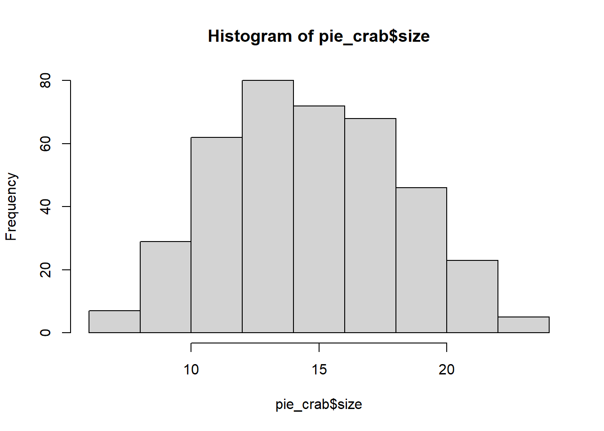

# Correlation and Simple Linear Regression


```r
# load in packages
library(tidyverse)
library(lterdatasampler)
library(rstatix)
library(lubridate) # THIS IS A NEW ONE FOR Y'ALL!
```

## Correlation with salamanders

Correlation measures the strength and direction of a relationship between **two continuous variables**. The key result of a correlation test, the correlation coefficient (*r*), ranges from -1 to +1, with 0 indicating no linear relationship, -1 a perfect negative relationship and 1 indicating a perfect positive relationship.

We will use the `and_vertebrates` data set to demonstrate the correlation test; we can test our length and weight continuous variables to see if "long" salamanders also weigh more.

First, we'll need to clean our data set to just include salamanders, and remove missing values for length and weight. Let's focus on the variable `length_2_mm` for snout-to-tail length.


```r
data("and_vertebrates")

sal <- and_vertebrates %>% 
  # find observations that contain the string "salamander" in the species column:
  filter(grepl("salamander", species)) %>%
  drop_na(length_2_mm, weight_g)
```

#### EDA

Before diving in, let's visually explore the relationship between our two variables with a scatter plot:


```r
ggplot(data = sal) + 
  geom_point(aes(x = length_2_mm, y = weight_g)) +
  theme_bw()
```


From our plot, we see that there is indeed a pretty visible relationship between a salamander's weight and length. In other words, a salamander's weight and length seem to be **positively correlated:** as length increases, weight also increases, and vice versa. Moreover, this relationship does not appear linear. And, we will need to see what the distribution of our variables looks like:


```r
hist(sal$length_2_mm) # skewed... is it technically "normal" distribution?
```


```r
hist(sal$weight_g) # def non normal distribution
```


They both look pretty skewed, therefore likely not normally distributed. We can statistically test if a variable fits a normal distribution with the `shapiro.test()` function. However, this function only runs for 5000 observations or less. Therefore, we will need to test for normality on a random subset of our full data set:


```r
sal_sub <- sal %>% slice_sample(n = 5000) 
  
shapiro.test(sal_sub$length_2_mm)
```

```
## 
## 	Shapiro-Wilk normality test
## 
## data:  sal_sub$length_2_mm
## W = 0.92984, p-value < 2.2e-16
```

```r
shapiro.test(sal_sub$weight_g)
```

```
## 
## 	Shapiro-Wilk normality test
## 
## data:  sal_sub$weight_g
## W = 0.55547, p-value < 2.2e-16
```

The *null hypothesis of the Shapiro-Wilk normality test is that the variable is normally distributed*, so a p-value less than 0.05, at 95% confidence (as we see for both of our variables here) tells use that our data does not fit a normal distribution.

Therefore we have two options as we did with our t-test example in the previous lesson: transform the variables or use a non-parametric test. Here, we will go ahead with a non-parametric Spearman correlation test.

#### Correlation test in R

In R, we can perform this correlation test using the {rstatix}'s `cor_test()` function:


```r
cor_test(sal,
         vars = c(length_2_mm, weight_g), # vector of continuous vars we want to test
         alternative = "two.sided", # we want to test both positive and negative corr.
         method = "spearman") # spearman is for non-parametric corr. method
```

```
## # A tibble: 1 × 6
##   var1        var2       cor  statistic     p method  
##   <chr>       <chr>    <dbl>      <dbl> <dbl> <chr>   
## 1 length_2_mm weight_g  0.98 820565131.     0 Spearman
```

**`cor`** is the correlation coefficient, *r*. In this example it is positive, indicating that there is a positive correlation between weight and length. Remember that *r* can only range from -1 to +1. So, a value of 0.98 indicates a very strong relationship.

`statistic` is the test statistic (t) which is calculated using *r* and the number of observations in the test.

`p` is the p-value. Here, it is calculated using the confidence level and the test statistic.

::: {.alert .alert-info}
When two continuous variables are normally distributed and appear to have a linear relationship, one should use the *Pearson correlation test*.
:::

#### **Correlation limitations**

Using a correlation test, we identified that a salamander's weight and its length have a positive relationship. But, our conclusions have to stop there: all we can deduce from a correlation test is whether or not a relationship exists. There is no information about which one leads to the other (i.e., causality), and there is no information about how we might be able to predict one from the other.

## Simple linear regression with crabs

In the summer of 2016, researchers surveyed fiddler crabs for their size across the Atlantic coast - from Florida to Massachusetts. Additional information about where the crabs lived (including coordinates, air, and water temperature) was also provided. Because we have size data across multiple climates, this study provides an excellent data set to test Bergmann's rule.

With this data set, we can broadly assume that the further north we go, the colder the climate. Therefore, let's use latitude as our variable to represent "coldness", with an increase in latitude representing cooler climate conditions, to explore the relationship between crab size and climate.

Taking correlation a step further, simple linear regression allows us to describe the relationship between two continuous, linearly-related variables. This description comes in the form of an equation that produces a line of best fit through our variables plotted against each other. Using that line, we can then predict a new crab's size based on its location, and vice versa.

But first we must define which variable leads to the other's change, something we didn't really need to think about for correlation. Based on Bergmann's rule, we know that the cooler climate leads to increased size, so our explanatory variable (*x*) will be latitude, and our response variable (*y*) will be crab size. There are a few ways to describe this relationship between latitude and size in the statistics lexicon:

|                                |                                 |
|--------------------------------|---------------------------------|
| **X Variable (Crab Latitude)** | **Y Variable (Crab Size)**      |
| Cause (what changes)           | Effect (outcome of that change) |
| Independent                    | Dependent                       |
| Predictor                      | Outcome                         |
| Explanatory                    | Response                        |

Let's first visualize latitude vs. size with some histograms and a scatter plot.


```r
hist(pie_crab$latitude)
```


```r
hist(pie_crab$size)
```



It is clear that crab data was surveyed at only a finite number of locations, which leads to a non-normal distribution. But that's okay - linear regression does NOT require the variables to be normally distributed. However, the error of the data must be normally distributed around the linear line (more on error later).

When plotting, it is important to have the predictor variable on the x-axis, and the response variable on the y-axis. Then, we can fit a linear regression line through this data so that the distance between the line and the most observations is at its lowest:


```r
ggplot(data = pie_crab, aes(x = latitude, y = size)) + 
  geom_point() +
  geom_smooth(method = "lm", se = FALSE) +
  theme_bw() 
```


Each observation's vertical distance away from the line is the observation's **error**. Getting the standard deviation of these distances gives us the line's **residual standard error**.

The intercept of this line, or the value of the line if we extended it out to meet the y-axis (i.e., where our crab size is zero), is also known as the line's **constant**.

Lastly, we have our **slope** of the line. This tells us how much a crab's average size increases if we increase the latitude, and vice versa.

When we put all of these pieces together, we get the following **simple linear regression equation for each observation**:

size = slope of the line \* latitude + constant + point's distance from line

... which we write statistically as:

$y = (β1 * x) + β0 + ε$

In this equation, *y* is a our response variable (crab's size), β0 is the constant, β1 is the slope, x is our explanatory variable (the crab's latitude), and ε is the distance between the line and each observation's true size.

#### Simple linear regression in R

In R, we can identify the values that go into delineating this line of best fit using the base R {stats} package's `lm()` function (lm for linear model):


```r
# Simple linear regression model
slr_model <- lm(size ~ latitude, data = pie_crab) # lm(response ~ predictor, data = dataset)

summary(slr_model)
```

```
## 
## Call:
## lm(formula = size ~ latitude, data = pie_crab)
## 
## Residuals:
##     Min      1Q  Median      3Q     Max 
## -7.8376 -1.8797  0.1144  1.9484  6.9280 
## 
## Coefficients:
##             Estimate Std. Error t value Pr(>|t|)    
## (Intercept) -3.62442    1.27405  -2.845  0.00468 ** 
## latitude     0.48512    0.03359  14.441  < 2e-16 ***
## ---
## Signif. codes:  0 '***' 0.001 '**' 0.01 '*' 0.05 '.' 0.1 ' ' 1
## 
## Residual standard error: 2.832 on 390 degrees of freedom
## Multiple R-squared:  0.3484,	Adjusted R-squared:  0.3467 
## F-statistic: 208.5 on 1 and 390 DF,  p-value: < 2.2e-16
```

... where -3.62442 is our line's intercept (β0), 0.48512 is our line's slope (β1):

$y = 0.48512x - 3.62442$

In the model's summary, our p-value is indicated in the `Pr(>|t|)` column for `latitude`: because our p-value is well below 0.05, we can deduce that latitude has a significant effect on crab size. Therefore, fiddler crabs appear to follow Bergmann's rule: on average, crab size increased by 0.49 mm for every degree in latitude.

#### Predicting crab size

With this linear equation, we can now predict crab size at different latitudes using the base R `predict()` function.

Let's predict crab size for latitudes of 32, 36, and 38 degrees. Note that we need to create these values as a new data frame with the same column name used in the data that the model was built off of (i.e., `latitude`):


```r
new_lat <- tibble(latitude = c(32, 36, 38))

predict(slr_model, newdata = new_lat)
```

```
##        1        2        3 
## 11.89939 13.83987 14.81010
```

## Exercises

For this week's exercise, we will be using the `ntl_airtemp` and `ntl_icecover` data sets to explore the relationship between mean annual lake ice duration and mean winter air temperature at two nearby lakes in Wisconsin. `ntl_airtemp` contains daily estimates of the air temperature near the two lakes. `ntl_icecover` contains the duration of ice cover per year, per lake.


```r
data("ntl_airtemp")
data("ntl_icecover")
```

First, let's get the average lake ice duration across years:


```r
avg_icecover <- ntl_icecover %>%
  # mutate within group by, and create a new variable for the WATER year (Oct - Sept). Water year is the FUTURE year so we do year + 1
  group_by(wyear = year + 1) %>%
  summarize(mean_duration = mean(ice_duration, na.rm = TRUE))
```

Next, we will need to compute the mean winter (November-April) air temperature per *water year* to align with the data in `avg_icecover`. A *water year* is a 12-month period starting in October and ending in September, aligning with the winter season and thereby not splitting up the winter.

Let's first define each date's water year using an `if_else()` statement and the `month()` function from the {lubridate} package:


```r
ntl_airtemp_wyear <- ntl_airtemp %>%
  # Add a column to group the Fall and Spring season into a same year 
  # (similar to hydrologic "water years") using the lubridate package:
  mutate(wyear = if_else(month(sampledate) < 10, year, year+1))
```

Next, using `ntl_airtemp_wyear`, we can compute the average air temperature for the winter season per water year.


```r
ntl_winter_airtemp <- ntl_airtemp_wyear %>%
  filter(lubridate::month(sampledate) %in% c(11, 12, 1:4)) %>% # filter the months from Nov to April
  group_by(wyear) %>%
  summarize(mean_air_temp = mean(ave_air_temp_adjusted))
```

**1.** Join your table of (water-)yearly average winter temperatures to our `avg_icecover` object. Save this new table as `icecover_temp`. (HINT: use a `join()` function to do this.)


<br>

**2.** Visualize the data by plotting our variables against one another, and using histograms. Is their relationship linear? Are our variables normally distributed?


<br>

**3.** Perform a correlation test on `icecover_temp` to see whether there is a significant relationship between mean ice duration and mean air temperature. What is the test statistic of this relationship? Is the relationship positive or negative?


<br>

**4.** Use a simple linear model to predict the mean ice duration for a year whose mean temperature is -2 degrees, 0 degrees, and 2 degrees.


<br>

**5.** Plot the average air temperature against the average ice cover duration. Include our simple linear regression (i.e., the line of best fit) in the plot.


<br>

**6.** What are the slope, intercept, and the residual standard error of our simple linear regression line?


## Citations

***Data Source:*** Anderson, L. and D. Robertson. 2020. Madison Wisconsin Daily Meteorological Data 1869 - current ver 32. Environmental Data Initiative. https://doi.org/10.6073/pasta/e3ff85971d817e9898bb8a83fb4c3a8b (Accessed 2021-03-08).

***Data Source:*** Johnson, D. 2019. Fiddler crab body size in salt marshes from Florida to Massachusetts, USA at PIE and VCR LTER and NOAA NERR sites during summer 2016. ver 1. Environmental Data Initiative. https://doi.org/10.6073/pasta/4c27d2e778d3325d3830a5142e3839bb (Accessed 2021-05-27).

***Data Source:*** Magnuson, J.J., S.R. Carpenter, and E.H. Stanley. 2021. North Temperate Lakes LTER: Ice Duration - Madison Lakes Area 1853 - current ver 35. Environmental Data Initiative. https://doi.org/10.6073/pasta/ab31f2489ee436beb73fc8f1d0213d97 (Accessed 2021-03-08).

Magnuson, J.J. 2021. Seeing the invisible present and place: from years to centuries with lake ice from Wisconsin to the Northern Hemisphere. Chapter 9 (243- 277) in R. B. Waide and S. E. Kingsland [eds]. The Challenges of Long Term Ecological Research: A Historical Analysis. Springer, Archimedes Series #59. https://doi.org/10.1007/978-3-030-66933-1_9 (Accessed 2022-02-14).
