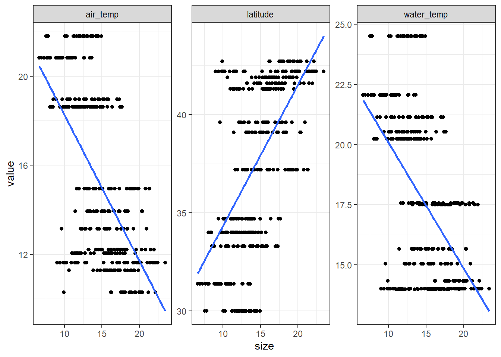
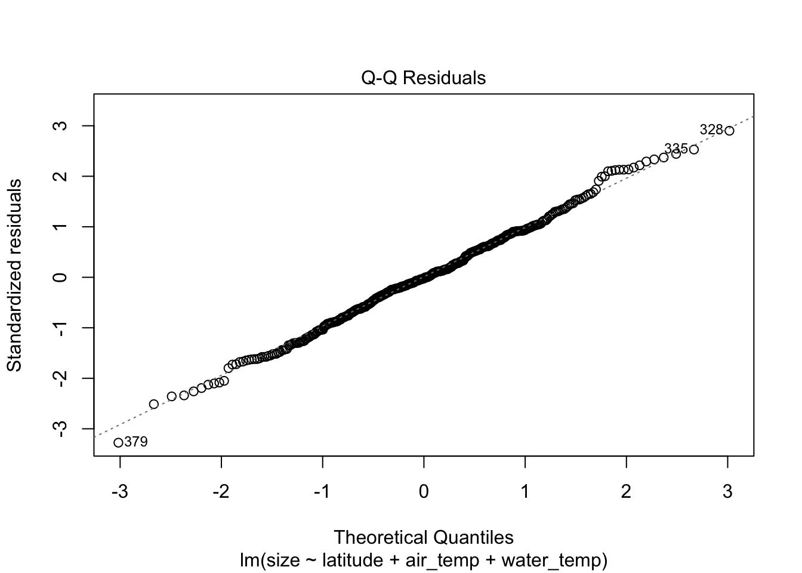

# Multiple Linear Regression (MLR)


```r
library(tidyverse)
library(lterdatasampler)
```

Multiple linear regression is the most common form of linear regression analysis. As a predictive analysis, multiple linear regression is used to explain the relationship between one continuous dependent variable (or, the response variable) and two or more independent variables (or, the predictor variables). The independent variables can be continuous OR categorical. Unlike a simple linear regression, where we describe the relationship between X and Y (two dimensional) and can simply plot them against each other, we are now working with multiple X's and Y - which is three-dimensional.

Here we are using the `pie_crab` data set again to develop a multiple linear regression model to predict crab size with additional variables from the data set, `latitude`, `air_temp`, and `water_temp`. Let's first plot each of our predictor variables' linear relationship with our response variable, crab size:


```r
data(pie_crab)

pie_crab_long <- pie_crab %>%
  select(size, latitude, air_temp, water_temp) %>%
  # select all but "size" to 
  pivot_longer(cols = -size)

ggplot(data = pie_crab_long, aes(x = size, y = value)) +
  geom_point() + 
  geom_smooth(method = "lm", se = FALSE) +
  facet_wrap(~name, scales = "free_y") + 
  theme_bw()
```



A multiple linear regression, at the location of each observation, incorporates each of our three variable's simple linear relationships with crab size using the following equation:

$y = β0 + (β1 * x1) + (β2 * x2) + (β3 * x3) + ε$

In this equation, *y* is a our response variable, crab size, while each *x* represents one of our predictor variables. *β0* represents the intercept; we can think of this as the value of *y* if all of our *x*'s were zero. Each *β* is called a **partial regression coefficient**; this is because we can think of each as the slope in the *x*'s dimension if all of our other *x*'s were held constant. Lastly, ε is the distance between our observation, and what our model predicts for it (i.e., observed - predicted).

## MLR in R

Running a multiple linear regression is very similar to the simple linear regression, but now we specify our multiple predictor variables by adding them together with a + sign (the order of our predictor variables does not matter). Here we are using the `pie_crab` data set again to develop a multiple linear regression model with additional variables from the data set:


```r
data(pie_crab)

mlr_model <- lm(size ~ latitude + air_temp + water_temp, data = pie_crab)

summary(mlr_model)
```

```
## 
## Call:
## lm(formula = size ~ latitude + air_temp + water_temp, data = pie_crab)
## 
## Residuals:
##     Min      1Q  Median      3Q     Max 
## -8.7099 -1.7195 -0.0602  1.7823  7.7271 
## 
## Coefficients:
##             Estimate Std. Error t value Pr(>|t|)    
## (Intercept)  77.7460    17.3477   4.482 9.76e-06 ***
## latitude     -1.0587     0.3174  -3.336 0.000933 ***
## air_temp     -2.4041     0.3844  -6.255 1.05e-09 ***
## water_temp    0.7563     0.1465   5.162 3.92e-07 ***
## ---
## Signif. codes:  0 '***' 0.001 '**' 0.01 '*' 0.05 '.' 0.1 ' ' 1
## 
## Residual standard error: 2.677 on 388 degrees of freedom
## Multiple R-squared:  0.4206,	Adjusted R-squared:  0.4161 
## F-statistic:  93.9 on 3 and 388 DF,  p-value: < 2.2e-16
```

... where:

**77.7460 is our line's intercept (β0)**

**-1.0587 is the slope in the latitude dimension,** or the estimated change in crab size for a unit change in latitude among crabs living with the same air temperature and water temperature conditions.

**-2.4041 is the slope in the air temperature dimension,** or the estimated change in crab size for a unit change in air temperature among crabs living with the same water temperature and latitude conditions.

**0.7563 is the slope in the water temperature dimension,** or the estimated change in crab size for a unit change in water temperature among crabs living with the same air temperature and latitude conditions.

$y = -1.0587x1 -2.4041x2 + 0.7563x3 + 77.7460$

In the model's summary, our p-value is indicated in the Pr(\>\|t\|) column for each variable: because our p-values are well below 0.01, we can deduce that each variable has a significant effect on crab size.

Our multiple R-squared (R^2^) is the Pearson correlation between the observed and the fitted (i.e. predicted) values. We can interpret this as 42.06% of the variability in crab size is explained by the linear regression on water temperature, air temperature, and latitude. **NOTE: R^2^ always increases when an additional predictor is added to a linear model.**

### Predicting crab size

With this multiple linear equation, we can now predict crab size across different varieties of latitude, air temperature, and water temperature using the base R `predict()` function:


```r
new_data <- tibble(latitude = c(32, 36, 38),
                   air_temp = c(20, 12, 9),
                   water_temp = c(22, 14, 11))

predict(mlr_model, newdata = new_data)
```

```
##        1        2        3 
## 12.42241 21.37004 24.19604
```

### MLR Assumptions

An important aspect when building a multiple linear regression model is to make sure that the following **key assumptions** are met:

**All observations are independent of one another.**

**There must be a linear relationship between the dependent and the independent variables.**

And:

**The variance of the residual errors is similar across the value of each independent variable.**


```r
plot(mlr_model, which = 1)
```


This "Residuals vs Fitted" (fitted meaning the predicted values) plot gives an indication if there are non-linear patterns. This is a bit subjective, but a good way of verifying that this assumption is met is by ensuring that no clear trend seems so exist. The residuals should also occupy equal space above and below the line, and along the length of the line.

**The residual error values are normally distributed.**


```r
plot(mlr_model, which = 2)
```



... also a bit subjective, but so long as the points on the Q-Q plot follow the dotted line, this assumption is fulfilled.

**The independent variables are not highly correlated with each other.**

Multicolinearity can lead to unreliable coefficient estimates, while adding more variables to the model will always increase the R^2^ value, reflecting a higher proportion of variance explained by the model that is unjust.


```r
pie_crab %>% 
  select(latitude, air_temp, water_temp) %>% 
  cor()
```

```
##              latitude   air_temp water_temp
## latitude    1.0000000 -0.9949715 -0.9571738
## air_temp   -0.9949715  1.0000000  0.9632287
## water_temp -0.9571738  0.9632287  1.0000000
```

Normally, we should exclude variables that have a correlation coefficient greater than 0.7/-0.7. Alas, all of our variables are HIGHLY correlated with each other. Therefore, these predictors should not all be used in our model. Which is also to say... it is a good idea to check your predictor variables for colinearity *before* developing a model.

## Exercises

We are interested in developing a multiple linear regression model to predict mean annual stream flow across the Eastern US. For every state, we have a handful of watershed and site characteristic data associated with USGS stream gauging stations.

Download the 'usgs' folder on Canvas and store it in a 'data' folder in this assignment's project directory. Here is a list of all of these files:


```r
data_files <- list.files('data/usgs', full.names = TRUE)
```

**1.** Read in each of the data sets associated with the assignment and combine them into a single data set. (HINT: What does map_dfr() do? 2.5 pts.


<br>

**2.** Using our combined data set, plot each variable against mean annual stream flow to identify variables that seem to have a linear relationship with stream flow. 5 pts.


<br>

**3.** Develop a multiple linear regression model using any combination of the variables in the data set. What is your R-squared value? Which of your variables (if any) are significant predictors of stream flow? 5 pts.


<br>

**4.** Check to see if your model meets the model assumptions required for MLR. 2.5 pts.


<br>

**5.** Use your model to predict mean annual stream flow for two new sets of predictor data. 2.5 pts.


<br>

**6.** If your model does not meet the model's assumptions, what are some ways of manipulating the data set so that it might? (HINT: review chapter 6) 2.5 pts.


## Citations

***Data Source:*** Johnson, D. 2019. Fiddler crab body size in salt marshes from Florida to Massachusetts, USA at PIE and VCR LTER and NOAA NERR sites during summer 2016. ver 1. Environmental Data Initiative. https://doi.org/10.6073/pasta/4c27d2e778d3325d3830a5142e3839bb (Accessed 2021-05-27).

Johnson DS, Crowley C, Longmire K, Nelson J, Williams B, Wittyngham S. The fiddler crab, Minuca pugnax, follows Bergmann’s rule. Ecol Evol. 2019;00:1–9. https://doi.org/10.1002/ece3.5883
